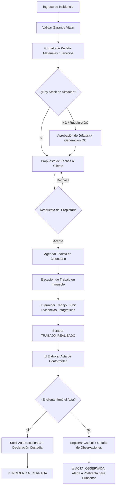

# 🏗️ Arquitectura Actual, Catálogo de Endpoints y Modelo de Datos
**Componente:** `vita-panel-propietario:panel.propietario`  
**Directorio Base:** `/local/components/vita-panel-propietario/panel.propietario/`  
**Fecha de Actualización:** Septiembre 2026  
**Estándar:** Bitrix24 D7 Controllerable + Spring Boot Microservices Integration

---

## 1. Ficha Técnica y Rol del Componente

El componente `panel.propietario` es el **núcleo operativo del Sistema de Postventa de Vitain Inmobiliaria**. Actúa como una aplicación web empresarial integrada dentro del entorno intranet de Bitrix24, cumpliendo una función de **orquestador bidireccional**:

```
 ┌─────────────────────────────────────────────────────────────┐
 │                    USUARIO EN NAVEGADOR                     │
 │          (Grid Bitrix, Modales UI, Formato A4, Slider)      │
 └──────────────┬──────────────────────────────▲───────────────┘
                │ AJAX (BX.ajax)               │ JSON Response
                ▼                              │
 ┌─────────────────────────────────────────────┴───────────────┐
 │       CONTROLADOR D7: VitaPanelPropietarioComponent         │
 │          (/local/components/.../class.php)                  │
 └──────────────┬──────────────────────────────▲───────────────┘
                │                              │
        ┌───────┴──────────────┐       ┌───────┴──────────────┐
        │  Servicios Locales   │       │  Repositorio Externo │
        │  (RequerimientoHl)   │       │   (SpringApiClient)  │
        └───────┬──────────────┘       └───────┬──────────────┘
                │                              │
                ▼                              ▼
 ┌─────────────────────────────┐ ┌─────────────────────────────┐
 │     MYSQL HIGHLOADBLOCKS    │ │   SPRING BOOT REST API      │
 │  (Tablas b_hlbd_* Indexadas)│ │   (http://dev-vita.xyz)     │
 └─────────────────────────────┘ └─────────────────────────────┘
```

* **Frontend:** Grid nativo Bitrix24 (`VITA_INCIDENCIAS_GRID`), Sliders (`BX.SidePanel`), modales con `BX.PopupWindow` y notificaciones `BX.UI.Notification.Center`.
* **Backend Interno:** Componente PHP D7 estructurado con arquitectura en capas (`lib/Services`, `lib/Repositories`, `lib/Grid`).
* **Backend Externo:** Microservicio Spring Boot que gestiona el estado maestro de la incidencia en la nube.
* **Canal Inbound (Webhook):** `api/responder_plan.php` que permite a Spring Boot enviar eventos hacia Bitrix24 cuando el propietario interactúa desde su portal.

---

## 2. Catálogo Completo de Endpoints y Comunicación AJAX

Todas las peticiones del frontend se gestionan a través del controlador unificado de Bitrix D7 (`/bitrix/services/main/ajax.php?action=vita-panel-propietario.panel.propietario.[accion]`).

### A. Estructura de Respuesta del Motor Bitrix D7 (Estándar JSend)
Toda acción ejecutada mediante `BX.ajax.runComponentAction` es envuelta por el motor de Bitrix en la siguiente estructura nativa:

```json
{
    "status": "success",     // "success" si HTTP 200, "error" si hubo excepción
    "data": {                // Contenido retornado por el método ...Action() en PHP
        "success": true,
        "actaId": 2,
        "estadoFinal": "INCIDENCIA_CERRADA"
    },
    "errors": []             // Arreglo de errores si status === "error"
}
```

### B. Matriz de Endpoints en `class.php`

| Acción (`Action`) | Método HTTP | Prefiltros Activos | Descripción Funcional | Entidades Afectadas |
| :--- | :---: | :---: | :--- | :--- |
| `validarIncidencia` | `POST` | `Auth` + `POST` | Valida técnicamente la procedencia de la garantía. | Spring Boot API |
| `coordinarVisita` | `POST` | `Auth` + `POST` | Registra fecha de inspección preliminar en el inmueble. | Spring Boot API |
| `patchIncidencia` | `POST` | `Auth` + `POST` | Actualiza campos libres y notas del flujo. | Spring Boot API |
| `actualizarStockAlmacen` | `POST` | `Auth` + `POST` | Registra cantidades disponibles en almacén vs compra. | `HlRequerimientosItems`, API |
| `actualizarCantidadesStock`| `POST` | `Auth` + `POST` | Actualización masiva de inventario para la incidencia. | `HlRequerimientosItems` |
| `procesarResolucionAprobacion`| `POST` | `Auth` + `POST`| Aprueba o rechaza la solicitud de materiales/OC. | `HlResolucionesAprobacion`, API |
| `subirAdjuntoCotizacion`| `POST` | `Auth` + `POST` | Sube archivo PDF de cotización de compras a `b_file`. | `HlPresupuestosIncidencia` |
| `responderPlanTrabajo` | `POST` | `Auth` + `POST` | Registra respuesta del cliente a propuesta de fechas. | `HlHistorialPlanTrabajo`, API |
| `obtenerHistorialPlanTrabajo`| `GET/POST`| `Auth` | Consulta el histórico de intentos de negociación. | `HlHistorialPlanTrabajo` |
| `obtenerDatosAgendamiento`| `GET/POST` | `Auth` | Retorna todistas activos y fecha aprobada. | `HlTodistas`, `HlHistorial` |
| `verificarDisponibilidadTodista`| `GET/POST`| `Auth` | Verifica si el todista tiene cruce de horario. | `HlAgendaTodistas` |
| `guardarAgendaTrabajo` | `POST` | `Auth` + `POST` | Reserva bloque de agenda, crea tarea en Bitrix Tasks. | `HlTareasTrabajo`, `HlAgendaTodistas`, `Tasks` |
| `obtenerDetalleTareaAgendada`| `GET/POST`| `Auth` | Consulta detalles de la tarea programada. | `HlTareasTrabajo` |
| `cerrarTrabajo` | `POST` | `Auth` + `POST` | **Transaccional:** Cierra tarea, guarda evidencias y pasa a `TRABAJO_REALIZADO`. | `HlTareasTrabajo`, `HlAgenda`, `Tasks`, API |
| `guardarActaConformidad`| `POST` | `Auth` + `POST` | **Transaccional:** Evalúa condicional (SÍ/NO), guarda firma/obs y cierra o pasa a observada. | `HlActasConformidad`, `Cabecera`, API |
| `obtenerActaConformidad`| `GET/POST` | `Auth` | Retorna los datos del acta registrada para el modal. | `HlActasConformidad` |

---

### C. Webhook Inbound Externo (`api/responder_plan.php`)
Permite al servidor externo de Spring Boot notificar a Bitrix24 cuando el cliente acepta o rechaza una fecha propuesta desde su interfaz web o correo:

* **URL:** `POST /local/components/vita-panel-propietario/panel.propietario/api/responder_plan.php`
* **Seguridad:** Requiere header `X-API-KEY: secreto_integracion_crm_2026_xyz`.
* **Payload Esperado:**
  ```json
  {
      "incidenciaId": 8,
      "decision": "ACEPTAR", // o "RECHAZAR"
      "fechaSeleccionada": "2026-09-24T12:00:00",
      "motivoRechazo": ""
  }
  ```
* **Acción en Bitrix:** Actualiza `HlHistorialPlanTrabajo`, actualiza `HlRequerimientosIncidencia` a `PLAN_TRABAJO_CONFIRMADO` y sincroniza el estado en la API.

---

## 3. Modelo Físico de Base de Datos (HighloadBlocks)

A diferencia de los IBlocks tradicionales de Bitrix (que usan tablas lentas con modelo EAV), el componente opera sobre **tablas físicas planas dedicadas en MySQL**.

### A. Mapa de Tablas Físicas y sus Índices B-Tree

| HighloadBlock (ORM D7) | Tabla Física MySQL | Índices Creados para Rendimiento | Propósito en el Flujo |
| :--- | :--- | :--- | :--- |
| `HlRequerimientosIncidencia` | `b_hlbd_requerimientos_incidencia` | `PRIMARY (ID)`<br>`idx_incidencia (UF_INCIDENCIA_ID)` | Cabecera del requerimiento, estado de stock y flujo. |
| `HlRequerimientosItems` | `b_hlbd_requerimientos_items` | `PRIMARY (ID)`<br>`idx_incidencia (UF_INCIDENCIA_ID)` | Detalle de recursos: solicitados, en almacén y compra. |
| `HlPresupuestosIncidencia` | `b_hlbd_presupuestos_incidencia` | `PRIMARY (ID)` | Cotizaciones adjuntas, montos y órdenes de compra. |
| `HlResolucionesAprobacion` | `b_hlbd_resoluciones_aprobacion` | `PRIMARY (ID)` | Auditoría de aprobaciones/rechazos con usuario y fecha. |
| `HlHistorialPlanTrabajo` | `b_hlbd_historial_plan_trabajo` | `PRIMARY (ID)` | Registro de propuestas de fechas y respuestas del cliente. |
| `HlTodistas` | `b_hlbd_todistas` | `PRIMARY (ID)` | Directorio de técnicos habilitados para asignación. |
| `HlTareasTrabajo` | `b_hlbd_tareas_trabajo` | `PRIMARY (ID)`<br>`idx_incidencia (UF_INCIDENCIA_ID)`<br>`idx_todista (UF_TODISTA_ID)`<br>`idx_task (UF_BITRIX_TASK_ID)` | Tarea técnica, evidencias fotográficas y observaciones. |
| `HlAgendaTodistas` | `b_hlbd_agenda_todistas` | `PRIMARY (ID)`<br>`idx_incidencia (UF_INCIDENCIA_ID)`<br>`idx_todista_fechas (UF_TODISTA_ID, UF_FECHA_INICIO, UF_FECHA_FIN)` | Calendario de disponibilidad y bloques de trabajo. |
| `HlActasConformidad` | `b_hlbd_actas_conformidad` | `PRIMARY (ID)`<br>`idx_incidencia (UF_INCIDENCIA_ID)` | Registro de actas firmadas o actas observadas. |

---

## 4. El Flujo BPMN Completo en Código



### Detalle de las Etapas Críticas Implementadas

#### Fase 1: Terminar Trabajo Técnico (`cerrarTrabajoTodista`)
* **Acción:** El todista concluye la labor en el departamento.
* **Modal:** `abrirModalCerrarTrabajoDesdeJS()` solicita observaciones finales y subida múltiple de fotos/archivos de evidencia (`archivos_evidencia[]`).
* **Operación Atómica (Transacción D7):**
  1. Guarda los archivos en el gestor `b_file`.
  2. Actualiza `HlTareasTrabajo` a `COMPLETADA` asociando los IDs de archivos.
  3. Actualiza el horario en `HlAgendaTodistas` a `COMPLETADO`.
  4. Marca la tarea nativa de Bitrix24 como Completada (`\CTasks::STATE_COMPLETED`).
  5. Envía PATCH a Spring Boot (`estadoServicio = 'TRABAJO_REALIZADO'`).

#### Fase 2: Elaboración de Acta de Conformidad (`guardarActaConformidad`)
* **Acción:** Formalización legal de la entrega del trabajo.
* **Modal:** `abrirModalActaConformidadDesdeJS()` presenta la decisión BPMN:
  * **Caso SÍ (Firmada Conforme):**
    * Campos: Nombre del firmante, DNI, fecha de firma, enlace Drive opcional, drag & drop para acta escaneada con firma (PDF/JPG hasta 10MB) y checkbox obligatorio de resguardo físico del documento original.
    * Transición: Estado terminal `INCIDENCIA_CERRADA`.
  * **Caso NO (Observada / No Firmada):**
    * Campos: Causal (Disconformidad con acabados, Propietario ausente, Trabajo inconcluso, Vicio adicional, Otro), detalle obligatorio de observaciones y foto de evidencia opcional.
    * Transición: Estado de contingencia `ACTA_OBSERVADA`.
* **Formato Oficial Imprimible:** Template dedicado [`imprimir-acta-conformidad.php`](file:///home/bitrix/www/local/components/vita-panel-propietario/panel.propietario/templates/.default/imprimir-acta-conformidad.php) en A4 con logo corporativo, que adapta su titulación, cláusulas y cajas de firma según la condicional elegida.

---

## 5. Optimizaciones de Rendimiento y Arquitectura Aplicadas

1. **Static Memoization de Clases ORM:**  
   Se eliminó la recompilación continua de entidades en `RequerimientoHlService.php` usando `$hlClassCache`. La clase del HighloadBlock se compila una sola vez en el ciclo de vida de la petición.
2. **Eliminación del Antipatrón N+1:**  
   `UserPermissionService::getUsuariosPorRolFromIblock162()` ahora consulta los datos de usuarios en un único batch con `UserTable::getList()`.
3. **Índices Físicos en MySQL:**  
   Se agregaron 8 índices B-Tree para que los filtros por `UF_INCIDENCIA_ID` y fechas se resuelvan en sub-milisegundos.
4. **Respuestas JSON Ligeras:**  
   Se eliminó el volcado redundante de Spring Boot (`apiResult`), haciendo que la respuesta de guardado sea un JSON limpio de solo 4 campos esenciales.
5. **Transacciones de Base de Datos:**  
   Se implementó `$connection->startTransaction()` y `$connection->commitTransaction()` para evitar registros desfasados o huérfanos.

---

## 6. Perspectiva Técnica: HighloadBlock vs. ORM D7 Puro

Dado que **los usuarios finales de la inmobiliaria nunca ingresan a `/bitrix/admin/`** y operan 100% dentro del panel personalizado:

* **Para lo desarrollado actualmente:** Los HighloadBlocks cumplen su cometido con excelencia gracias a los índices físicos y la caché estática implementada.
* **Para desarrollos futuros:** Se recomienda implementar tablas mediante **ORM D7 Puro (`DataManager`)**, ya que permite esquemas libres del prefijo `UF_`, definición de relaciones (`ReferenceField`) con JOINs automáticos en código y control de versiones 100% en Git sin depender de metadatos en la base de datos de Bitrix.
