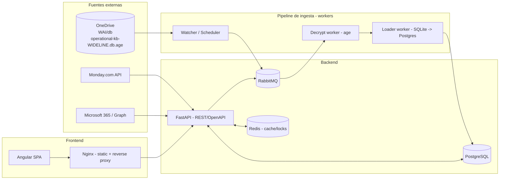
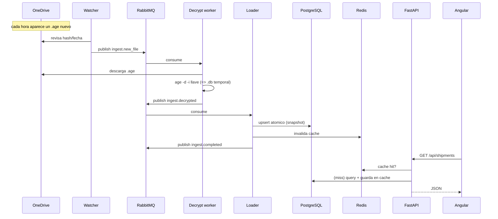

# Arquitectura de desarrollo — WAI / WIDELINE

**Stack:** Angular · FastAPI · Docker · Redis · RabbitMQ · SQLite/PostgreSQL
**Contexto:** plataforma operativa que consume los datos de Shipments de CargoWise que llegan
**cifrados** (`operational-kb-WIDELINE.db.age`) por OneDrive, los descifra con la llave `age`, los
carga y los expone vía API para un frontend Angular. Integra además Monday.com y Microsoft 365.

> Fecha: 2026-09-16 · Autor: ivan@ia.solutions

---

## 1. Objetivo y alcance

- **Ingerir** cada hora el snapshot cifrado (`.age`) desde OneDrive, descifrarlo (`age`) y cargarlo.
- **Exponer** los datos operativos (shipments, legs, containers, milestones, organizations, etc.)
  a través de una API REST (FastAPI) con autenticación.
- **Visualizar** en un dashboard Angular: seguimiento de shipments, milestones/ETAs, contenedores,
  clientes, rutas.
- **Orquestar** el trabajo asíncrono (descarga, descifrado, carga, notificaciones) con RabbitMQ.
- **Cachear** consultas frecuentes y sesiones con Redis.
- **Integrar** Monday.com (tableros/procesos) y Microsoft 365 / Graph (correo, calendario, auth).

Fuera de alcance: no se modifica CargoWise (es solo origen); no se guardan datos financieros
(el export no los incluye).

---

## 2. Vista de alto nivel



**Flujo resumido:** OneDrive → *watcher* detecta `.age` nuevo → publica mensaje en RabbitMQ →
*decrypt worker* descifra con la llave `age` → *loader* carga a PostgreSQL → FastAPI sirve los datos
(con caché en Redis) → Angular los muestra.

---

## 3. Componentes

### 3.1 Frontend — Angular
- **Angular 17+** (standalone components, signals), **Angular Material** o PrimeNG para UI.
- **Responsabilidades:** dashboard de shipments, filtros (ruta, modo, estado, cliente), detalle de
  Job con timeline de milestones, vista de contenedores y organizaciones, exportables.
- **Auth:** OIDC contra Microsoft Entra ID (`@azure/msal-angular`) usando la app
  *WAI - Microsoft 365 Integration* (flujo Authorization Code + PKCE).
- **Comunicación:** HTTP a `/api` (proxy por Nginx). Opcional WebSocket/SSE para refresco en vivo
  cuando entra un snapshot nuevo.
- **Build:** `ng build` → estáticos servidos por Nginx.

### 3.2 Backend — FastAPI
- **FastAPI + Uvicorn/Gunicorn**, Pydantic v2, SQLAlchemy 2.x, Alembic (migraciones).
- **Responsabilidades:**
  - API REST documentada (OpenAPI/Swagger en `/docs`).
  - Autenticación/authorization (valida tokens de Entra ID; RBAC por roles).
  - Lectura de datos operativos desde PostgreSQL, con caché en Redis.
  - Publica tareas en RabbitMQ (p. ej. "reprocesar snapshot", "sincronizar Monday").
  - Integraciones: cliente Monday.com (GraphQL) y Microsoft Graph.
- **Estructura sugerida:**
  ```
  app/
    main.py            # arranque FastAPI
    core/              # config, seguridad, settings (pydantic-settings)
    api/v1/            # routers: shipments, containers, milestones, orgs, admin
    models/            # SQLAlchemy
    schemas/           # Pydantic (DTOs)
    services/          # logica de negocio, clientes Monday/Graph
    repositories/      # acceso a datos
    workers/           # consumidores RabbitMQ (ingesta)
    db/                # sesion, migraciones
  ```

### 3.3 Workers de ingesta (RabbitMQ consumers)
Procesos separados (mismo código base, distinto entrypoint):
- **Watcher/Scheduler:** revisa OneDrive (rclone/Graph) cada N minutos o por cron; si hay `.age`
  nuevo (hash/fecha distinta), publica `ingest.new_file`.
- **Decrypt worker:** consume `ingest.new_file`, descarga el `.age`, ejecuta
  `age -d -i llave-privada.txt` → `.db` plano temporal; publica `ingest.decrypted`.
- **Loader worker:** consume `ingest.decrypted`, lee el SQLite y hace *upsert* a PostgreSQL
  (transacción, snapshot atómico); invalida caché Redis; publica `ingest.completed` (para notificar
  al frontend por WS/SSE).

### 3.4 RabbitMQ (mensajería/colas)
- **Uso:** desacoplar ingesta de la API; reintentos y *dead-letter* si falla descifrado o carga.
- **Exchanges/colas:**
  - `ingest` (topic): `ingest.new_file`, `ingest.decrypted`, `ingest.completed`.
  - `integrations`: `monday.sync`, `graph.notify`.
  - **DLX** `ingest.dlx` para mensajes fallidos + reintentos con backoff.
- **Por qué:** el descifrado/carga es pesado y periódico; conviene que no bloquee la API y que sea
  reintentable ante fallos (archivo corrupto, llave equivocada, etc.).

### 3.5 Redis (caché y coordinación)
- **Caché de consultas** frecuentes (top rutas, conteos, detalle de Job) con TTL alineado al ciclo
  horario del snapshot.
- **Locks distribuidos** (p. ej. evitar dos cargas simultáneas del mismo snapshot).
- **Rate-limiting** de la API y **sesiones**/tokens de corta vida si se usan.
- Opcional: **broker de Celery** si se prefiere Celery en lugar de consumidores propios.

### 3.6 Base de datos — PostgreSQL
- El SQLite que llega es un **snapshot regenerado entero cada corrida** (no acumula histórico).
- Se carga a **PostgreSQL** para: consultas concurrentes, índices, joins eficientes, y —si se
  desea— **historizar** (guardar cada snapshot con `snapshot_ts` para tendencias).
- Tablas espejo del diccionario: `shipments`, `transport_legs`, `containers`, `milestones`,
  `packing_lines`, `custom_fields`, `organizations`, `entry_headers` (todas ligadas por `job_key`).
- Nota del diccionario: casi todo es `TEXT` y los vacíos son `''` (no `NULL`) — el *loader* decide
  el tipado/parseo (fechas ISO-8601, `CAST` de pesos/volúmenes).

> Alternativa ligera: si no se necesita histórico ni alta concurrencia, se puede servir el SQLite
> directamente (montado read-only) y saltarse PostgreSQL. Recomendado PostgreSQL para producción.

---

## 4. Seguridad

- **Llave `age`:** es el secreto crítico. Vive **solo** en el `decrypt worker`, montada como
  **Docker secret** / variable segura, nunca en la imagen ni en el repo. Permisos `600`.
- **El `.db` plano** solo existe en memoria/tmpfs durante la carga y se borra (`shred`) al terminar.
- **Secretos M365/Monday:** en gestor de secretos (Docker secrets, Vault, o `.env` fuera de git).
- **Auth de usuarios:** Entra ID (OIDC). FastAPI valida el JWT (firma, audiencia, expiración).
- **Red:** solo Nginx expuesto (443). API, DB, Redis, RabbitMQ en red interna de Docker.
- **Principio de mínimo privilegio** en permisos de Graph (hoy: Mail/Calendars/Contacts delegados).

---

## 5. Despliegue (Docker Compose)

```yaml
# docker-compose.yml (esquema)
services:
  frontend:            # Angular build servido por Nginx (proxy /api -> api)
    build: ./frontend
    ports: ["443:443"]
    depends_on: [api]

  api:                 # FastAPI (Gunicorn+Uvicorn workers)
    build: ./backend
    environment:
      - DATABASE_URL=postgresql+psycopg://...
      - REDIS_URL=redis://redis:6379/0
      - RABBITMQ_URL=amqp://rabbit:5672/
    depends_on: [db, redis, rabbitmq]

  worker-watcher:      # detecta .age nuevos en OneDrive
    build: ./backend
    command: python -m app.workers.watcher
    depends_on: [rabbitmq]

  worker-ingest:       # descifra (age) + carga a Postgres
    build: ./backend
    command: python -m app.workers.ingest
    secrets: [age_private_key]
    depends_on: [rabbitmq, db, redis]

  db:
    image: postgres:16
    volumes: [pgdata:/var/lib/postgresql/data]

  redis:
    image: redis:7

  rabbitmq:
    image: rabbitmq:3-management
    ports: ["15672:15672"]   # panel de administracion

secrets:
  age_private_key:
    file: ./secrets/llave-privada.txt

volumes:
  pgdata:
```

- **Entornos:** `dev` (compose local), `staging`, `prod`. Variables por `.env` / secrets.
- **CI/CD:** build de imágenes, tests, `alembic upgrade head`, despliegue. Healthchecks por servicio.
- **Escalado:** `worker-ingest` y `api` escalan horizontalmente; RabbitMQ reparte carga.

---

## 6. Ciclo de datos (end-to-end)



---

## 7. Decisiones y trade-offs

| Tema | Decisión | Motivo |
|---|---|---|
| Ingesta asíncrona | RabbitMQ + workers | El descifrado/carga es pesado y periódico; no debe bloquear la API y debe ser reintentable |
| Almacenamiento | PostgreSQL (desde el SQLite) | Concurrencia, índices, joins e histórico opcional |
| Caché | Redis con TTL ~1h | El dato cambia máximo cada hora; caché barata y coherente con el ciclo |
| Descifrado | `age` en un solo worker con la llave como secret | Minimiza superficie del secreto; el plano nunca sale de ahí |
| Auth | Entra ID (OIDC/PKCE) | Ya existe la app M365; evita gestionar contraseñas propias |
| Frontend | Angular SPA + Nginx | SPA rica para dashboards; Nginx sirve estáticos y hace de reverse proxy |

---

## 8. Roadmap sugerido (fases)

1. **MVP lectura:** loader `.age`→Postgres + API `/shipments` + dashboard básico Angular.
2. **Ingesta robusta:** RabbitMQ, reintentos/DLX, watcher OneDrive, notificación en vivo.
3. **Caché e histórico:** Redis + snapshots historizados para tendencias/ETAs.
4. **Integraciones:** Monday (sincronizar procesos) y Graph (alertas por correo/calendario).
5. **Hardening:** secrets manager, RBAC fino, observabilidad (logs/metrics/tracing), CI/CD.

---

## 9. Componentes ya validados (base de esta arquitectura)

- 🔑 **Llave `age`** → válida contra el snapshot real de OneDrive (descifra `operational-kb-WIDELINE.db`).
- 🟢 **Monday.com** → token válido (cuenta Wideline).
- 🟡 **Microsoft 365 / Graph** → secreto válido; pendiente Redirect URI + login delegado (MFA) para
  el flujo del frontend.
- 🖥️ **Servidor Azure** → alcanzable (host de despliegue candidato).

Ver detalle en `../documents/VALIDACION_CREDENCIALES.md`.
