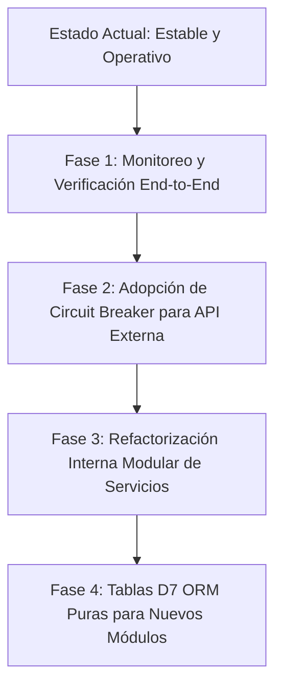

# 🩺 Diagnóstico Técnico y Análisis del Estado Actual del Componente
**Componente:** `vita-panel-propietario:panel.propietario`  
**Ruta del Componente:** `/local/components/vita-panel-propietario/panel.propietario/`  
**Fecha de Diagnóstico:** Septiembre 2026  
**Propósito:** Evaluación integral del estado operativo, arquitectura híbrida, flujo de datos, rendimiento y roadmap técnico sin alteración de la lógica de negocio.

---

## 📑 Índice de Contenidos
1. [Resumen Ejecutivo y Estado Operativo Actual](#1-resumen-ejecutivo-y-estado-operativo-actual)
2. [Arquitectura Híbrida y Flujo de Datos End-to-End](#2-arquitectura-híbrida-y-flujo-de-datos-end-to-end)
3. [El Ciclo AJAX y Diagnóstico de Respuestas JSON (Respuestas Pesadas vs. Ligeras)](#3-el-ciclo-ajax-y-diagnóstico-de-respuestas-json)
4. [Análisis Estratégico: HighloadBlocks vs. Tablas D7 ORM Puras (`DataManager`)](#4-análisis-estratégico-highloadblocks-vs-tablas-d7-orm-puras)
5. [Auditoría del Webhook Inbound (`api/responder_plan.php`)](#5-auditoría-del-webhook-inbound-apiresponder_planphp)
6. [Radiografía e Inventario de Archivos del Componente](#6-radiografía-e-inventario-de-archivos-del-componente)
7. [Matriz de Salud Técnica: Fortalezas, Deudas y Puntos Críticos](#7-matriz-de-salud-técnica-fortalezas-deudas-y-puntos-críticos)
8. [Hoja de Ruta Recomendada (Evolución Segura y Gradual)](#8-hoja-de-ruta-recomendada-evolución-segura-y-gradual)

---

## 1. Resumen Ejecutivo y Estado Operativo Actual

El componente `panel.propietario` opera como el **sistema de control central de Postventa Inmobiliaria** de Vitain. Gestiona el ciclo de vida completo de reclamos y garantías desde que un propietario registra una incidencia hasta el cierre formal mediante Acta de Conformidad.

### Estado de las Fases del Flujo BPMN:
```
[1. Validación Técnica] ➔ [2. Inspección / Visita] ➔ [3. Presupuesto & Stock] ➔ [4. Aprobación Jefatura] ➔ [5. Agendamiento Todista] ➔ [6. Ejecución & Cierre] ➔ [7. Acta Conformidad (A4)]
```

* **Fase 1 a 4 (Requerimientos, Almacén y Aprobación de OC):**  
  *Operativo al 100%.* Permite a los analistas revisar ítems, descontar de stock disponible en almacén o generar solicitud de compra, y someter a aprobación de jefaturas con firmas/resoluciones.
* **Fase 5 (Plan de Trabajo y Agendamiento de Todistas):**  
  *Operativo al 100%.* Permite proponer hasta 3 fechas tentativas al cliente, recibir la confirmación (vía webhook externo o gestión interna), verificar disponibilidad de horarios de técnicos en `b_hlbd_agenda_todistas` y generar la tarea en Bitrix Tasks.
* **Fase 6 (Ejecución de Trabajo y Evidencias):**  
  *Operativo al 100%.* El técnico o supervisor concluye la labor, adjunta fotografías de evidencia en `b_file` y marca la orden como `TRABAJO_REALIZADO` de manera atómica.
* **Fase 7 (Elaboración y Emisión de Acta de Conformidad):**  
  *Operativo al 100%.* Soporta la bifurcación lógica BPMN:
  * **Si el cliente firmó Conforme (SÍ):** Se registra la firma y la incidencia transiciona a `INCIDENCIA_CERRADA`.
  * **Si el cliente NO firmó (Observada):** Se selecciona el checklist de motivos (desacuerdo en acabados, trabajo incompleto, daños colaterales, ausencia del titular), detalle descriptivo y compromiso de Postventa, transicionando a `ACTA_OBSERVADA`.
  * **Emisión Impresa:** Cuenta con plantilla oficial A4 (`imprimir-acta-conformidad.php`) con branding corporativo embebido (Base64), tabla dinámica de trabajos y bloques condicionales de firma/observación listos para firma física o huella digital.

---

## 2. Arquitectura Híbrida y Flujo de Datos End-to-End

El sistema no depende únicamente de Bitrix24 ni únicamente de un servidor externo; opera bajo una **arquitectura híbrida distribuida**:

```
 ┌────────────────────────────────────────────────────────────────────────┐
 │                         NAVEGADOR DEL USUARIO                          │
 │         (Bitrix Main UI Grid + Modales BX.PopupWindow + Sliders)       │
 └──────────────┬──────────────────────────────────────────▲──────────────┘
                │ Petición AJAX (POST)                     │ JSON Optimizado
                ▼                                          │
 ┌─────────────────────────────────────────────────────────┴──────────────┐
 │             CONTROLADOR BITRIX D7 (class.php)                          │
 │      - Valida sesión de usuario (ActionFilter\Authentication)          │
 │      - Fuerza protocolo seguro (ActionFilter\HttpMethod POST)           │
 │      - Despacha a Servicios de Dominio                                 │
 └──────────────┬──────────────────────────────────────────▲──────────────┘
                │                                          │
        ┌───────┴──────────────┐                   ┌───────┴──────────────┐
        │  Servicios Locales   │                   │  Cliente API REST    │
        │  RequerimientoHl...  │                   │   SpringApiClient    │
        └───────┬──────────────┘                   └───────┬──────────────┘
                │ Transacciones ACID                       │ HTTP cURL / JSON
                ▼                                          ▼
 ┌─────────────────────────────┐            ┌─────────────────────────────┐
 │    MYSQL BITRIX24 LOCAL     │            │    SPRING BOOT EXTERNO      │
 │  - HighloadBlocks (b_hlbd_*)│            │     (http://dev-vita.xyz)   │
 │  - Tablas Core Bitrix       │            │  - Base de datos maestra    │
 │    (b_file, b_tasks)        │            │  - Portal del Propietario   │
 └─────────────────────────────┘            └──────────────┬──────────────┘
                                                           │ Webhook Event
                                                           ▼ (POST X-API-KEY)
                                            ┌─────────────────────────────┐
                                            │ api/responder_plan.php      │
                                            │ (Punto de Entrada Inbound)  │
                                            └─────────────────────────────┘
```

### Roles y Responsabilidades de Cada Capa:
1. **Bitrix24 (Frontend & UI):** Interfaz para ingenieros residentes, asistentes de postventa y jefaturas. Muestra el estado en tiempo real dentro del Grid nativo con filtros avanzados.
2. **Bitrix24 (Backend D7):** Orquesta la lógica local (stock de almacén, horas agendadas de todistas, tareas de Bitrix, actas de entrega y auditoría transaccional).
3. **Spring Boot (Backend Cloud):** Administra el estado global de la incidencia a nivel corporativo y expone las interfaces públicas para que los propietarios revisen el estado de sus reclamos desde dispositivos móviles o portales externos.

---

## 3. El Ciclo AJAX y Diagnóstico de Respuestas JSON

Una de las dudas arquitectónicas más frecuentes en el componente radicaba en la estructura del JSON y el peso de las respuestas:

### A. ¿De quién es la estructura `{"status": "success", "data": {...}, "errors": []}`?
* **Es el estándar nativo de Bitrix24 D7 (`Bitrix\Main\Engine\Controller`).**
* Bitrix implementa la especificación **JSend**. Toda acción ejecutada mediante `BX.ajax.runComponentAction` es interceptada por el kernel de Bitrix:
  * Si el método PHP termina con éxito, Bitrix crea un envoltorio con `"status": "success"` y coloca lo que retorna la función dentro de la propiedad `"data"`.
  * Si se lanza una excepción o se agrega un error a `this->errorCollection`, Bitrix responde automáticamente con `"status": "error"`, código HTTP 400/500 y llena `"errors": [...]`.

### B. ¿Por qué antes se generaba un JSON de más de 2,500 bytes al guardar un acta?
* **Causa Raíz:** En `class.php`, al invocar la API de Spring Boot para sincronizar el estado, el método `guardarActaConformidadAction` incluía la variable `'apiResult' => $resApi` en el array de retorno.
* **El Problema:** La API de Spring Boot responde devolviendo la entidad completa de la incidencia:
  * 72 campos de formulario (`detalles` con checklist de pisos, paredes, grifería, observaciones).
  * Objeto anidado de cliente (nombre, DNI, teléfono, correo).
  * Objeto de inmueble (proyecto, edificio, número de departamento).
  * Fechas de creación, actualización y auditoría.
* **Consecuencia:** Bitrix tomaba ese objeto inmenso y lo serializaba dentro de `data.apiResult`. El navegador del usuario recibía un payload innecesariamente pesado que nunca era consumido por el JavaScript del frontend (el modal de JavaScript solo necesita confirmar `success: true` y el ID del acta).
* **Solución Implementada:** Se despojó la respuesta de `$resApi`. Ahora la respuesta es ultraligera (~80 bytes):
  ```json
  {
      "status": "success",
      "data": {
          "success": true,
          "actaId": 2,
          "incidenciaId": 8,
          "firmoCliente": "S",
          "estadoActa": "FIRMADA_CONFORME",
          "nuevoEstadoFlujo": "INCIDENCIA_CERRADA"
      },
      "errors": []
  }
  ```

---

## 4. Análisis Estratégico: HighloadBlocks vs. Tablas D7 ORM Puras (`DataManager`)

Un hallazgo determinante en el análisis del negocio es:  
> **"Los usuarios operativos y administradores NUNCA ingresan al panel administrativo de Bitrix (`/bitrix/admin/`). Todo el trabajo se realiza al 100% dentro del componente visual."**

Esta premisa cambia radicalmente la balanza técnica entre usar **HighloadBlocks** o **Tablas D7 ORM Puras**:

### Matriz Comparativa Exhaustiva

| Característica | HighloadBlocks (`Bitrix\Highloadblock`) | Tablas D7 Personalizadas (`DataManager`) | Impacto en el Proyecto |
| :--- | :--- | :--- | :--- |
| **Interfaz en `/bitrix/admin/`** | ✅ Genera panel administrativo automático con filtros y edición manual. | ❌ No tiene interfaz administrativa en `/bitrix/admin/` por defecto (requiere programarla si se necesitara). | **Irrelevante:** Como los usuarios nunca entran al panel admin, esta ventaja de los HighloadBlocks se desperdicia por completo. |
| **Estructura y Migración** | ⚠️ Requiere crear el HL en base de datos local y exportar/importar metadatos en cada entorno (dev, test, prod). | ✅ **100% Código en Git:** Se define la tabla y campos en clases PHP o scripts SQL versionables sin depender de la UI de Bitrix. | **Superior en D7:** Permite despliegues automatizados (CI/CD) sin configuración manual en el panel de Bitrix de producción. |
| **Nombres de Campos** | ❌ Obliga al prefijo `UF_` (`UF_INCIDENCIA_ID`, `UF_OBSERVACIONES`). | ✅ Nombres limpios, naturales y según convención (`incidencia_id`, `created_at`). | **Mayor legibilidad** y compatibilidad con APIs REST y JSON. |
| **Sobrecarga de Metadata (Queries)** | ⚠️ Requiere consultar `b_hlblock_entity` y compilar dinámicamente la clase en tiempo de ejecución (`compileEntity`). | ✅ **Cero overhead:** La clase PHP ya existe en disco (`/local/lib/ORM/`), el autoloading la carga de inmediato. | **Mayor velocidad:** Ahorra de 1 a 2 queries por request y evita el calentamiento dinámico de entidades. |
| **Relaciones y Joins (`ReferenceField`)** | ⚠️ Relaciones complejas y lentas a través de campos UF tipo elemento de lista o cadena. | ✅ Soporte nativo de `ReferenceField` con claves foráneas e índices relacionales reales en MySQL. | **Consultas unificadas:** Permite hacer consultas con JOINs directos entre tablas sin bucles de consultas N+1. |
| **Tipado Estricto de Columnas** | ⚠️ Los tipos están restringidos a los tipos de campos de usuario de Bitrix (string, integer, double, boolean, file). | ✅ Soporte para tipos MySQL nativos (`BIGINT UNSIGNED`, `ENUM`, `JSON`, `DECIMAL(12,2)`, etc.). | **Mayor integridad referencial** y consistencia de datos a nivel de motor de base de datos. |

### Conclusión y Veredicto Arquitectónico:
1. **Para lo que ya existe:** No se debe romper ni reescribir lo que ya está en producción sobre HighloadBlocks (`b_hlbd_requerimientos_incidencia`, `b_hlbd_agenda_todistas`, `b_hlbd_actas_conformidad`), ya que funciona de forma estable tras la creación de índices B-Tree y static memoization.
2. **Para nuevas entidades y módulos futuros:** La mejor práctica senior, dado que no se requiere el panel `/bitrix/admin/`, es crear **tablas MySQL nativas mapeadas con clases `DataManager` de Bitrix D7**. Esto otorga velocidad máxima, versionado 100% en Git y consultas relacionales directas.

---

## 5. Auditoría del Webhook Inbound (`api/responder_plan.php`)

El archivo [responder_plan.php](file:///home/bitrix/www/local/components/vita-panel-propietario/panel.propietario/api/responder_plan.php) representa el canal de entrada desde el mundo exterior hacia Bitrix24:

### A. Diagnóstico Operativo
* **Función:** Permite que el servidor externo de Spring Boot informe a Bitrix cuando un propietario acepta o rechaza una propuesta de fecha para la visita del todista.
* **Seguridad Actual:** Valida la cabecera `X-API-KEY: secreto_integracion_crm_2026_xyz`.
* **Registro de Auditoría:** Escribe en `responder_plan.log` cada petición entrante, permitiendo trazabilidad de IP, payload y headers recibidos.

### B. Análisis del Archivo de Logs (`responder_plan.log`)
Al inspeccionar las últimas entradas del log, se constata actividad real desde la IP `54.173.67.92` (servidor de aplicaciones AWS de Spring Boot):
```
2026-09-23 02:46:02 | IP: 54.173.67.92 | Method: POST | URI: /.../responder_plan.php | Body: {"incidenciaId":8,"decision":"PLAN_TRABAJO_ACEPTADO","fechaSeleccionada":"2026-09-24T12:00:00","motivoRechazo":null}
```
* **Estado:** El endpoint está respondiendo de manera correcta, procesando los payloads JSON e impactando `b_hlbd_historial_plan_trabajo` y la cabecera de la incidencia.

---

## 6. Radiografía e Inventario de Archivos del Componente

A continuación se detalla el mapa de archivos que componen este módulo:

### A. Controlador y Configuración
* [class.php](file:///home/bitrix/www/local/components/vita-panel-propietario/panel.propietario/class.php) *(~1,150 líneas)*  
  **Rol:** Controlador maestro del componente. Implementa `Controllerable`.  
  **Estado:** Robusto. Posee prefiltros de autenticación (`ActionFilter\Authentication`) y restricción de verbos (`ActionFilter\HttpMethod([POST])`). Gestiona la preparación del Grid y 16 acciones AJAX.

### B. Capa de Servicios (`lib/Services/`)
* [RequerimientoHlService.php](file:///home/bitrix/www/local/components/vita-panel-propietario/panel.propietario/lib/Services/RequerimientoHlService.php) *(~1,720 líneas - 76 KB)*  
  **Rol:** Núcleo de persistencia local en HighloadBlocks (Cabeceras, Stock, Resoluciones, Todistas, Agenda, Actas).  
  **Estado:** Altamente funcional y optimizado con transacciones atómicas (`$connection->startTransaction()`) y memoización de entidades HL.
* [UserPermissionService.php](file:///home/bitrix/www/local/components/vita-panel-propietario/panel.propietario/lib/Services/UserPermissionService.php) *(~120 líneas)*  
  **Rol:** Resuelve si el usuario logueado es Administrador, Jefatura o Analista de Postventa.  
  **Estado:** Optimizado. Se erradicó la consulta N+1 mediante batch query con `UserTable::getList()`.
* [SolicitudPedidoService.php](file:///home/bitrix/www/local/components/vita-panel-propietario/panel.propietario/lib/Services/SolicitudPedidoService.php) *(~150 líneas)*  
  **Rol:** Orquesta la generación de solicitudes de pedido para compras de almacén.
* [IncidenciaFilterService.php](file:///home/bitrix/www/local/components/vita-panel-propietario/panel.propietario/lib/Services/IncidenciaFilterService.php) *(~200 líneas)*  
  **Rol:** Aplica filtros lógicos sobre los listados de incidencias recuperados de la API externa.

### C. Capa de Repositorios y Clientes Externos (`lib/Repositories/`)
* [SpringApiClient.php](file:///home/bitrix/www/local/components/vita-panel-propietario/panel.propietario/lib/Repositories/SpringApiClient.php) *(~450 líneas - 16 KB)*  
  **Rol:** Cliente HTTP (cURL) que consume los microservicios de Spring Boot (`http://dev-vita.xyz`).  
  **Estado:** Implementa timeouts de conexión (5s) y de respuesta (15s), manejo de códigos de estado HTTP y logs de auditoría en `/upload/spring_api_debug.log`.
* [BitrixCrmRepository.php](file:///home/bitrix/www/local/components/vita-panel-propietario/panel.propietario/lib/Repositories/BitrixCrmRepository.php) *(~40 líneas)*  
  **Rol:** Consultas puntuales hacia entidades del CRM nativo de Bitrix.

### D. Capa de Grid y Presentación (`lib/Grid/`)
* [GridColumnBuilder.php](file:///home/bitrix/www/local/components/vita-panel-propietario/panel.propietario/lib/Grid/GridColumnBuilder.php) *(~850 líneas - 31 KB)*  
  **Rol:** Construye la estructura visual de filas, celdas formateadas con badges HTML, contadores de días de garantía y menú desplegable de acciones según el estado de la incidencia.
* [GridFilterBuilder.php](file:///home/bitrix/www/local/components/vita-panel-propietario/panel.propietario/lib/Grid/GridFilterBuilder.php) *(~40 líneas)*  
  **Rol:** Define los campos y tipos para el filtro superior del Grid de Bitrix.

### E. Frontend y Modales (`templates/.default/`)
* [template.php](file:///home/bitrix/www/local/components/vita-panel-propietario/panel.propietario/templates/.default/template.php): Contenedor del Grid, botones superiores y carga de assets.
* [costos.js](file:///home/bitrix/www/local/components/vita-panel-propietario/panel.propietario/templates/.default/js/subprocesos/costos.js): Motor JavaScript modular que gestiona modales interactivos:
  * Modal de Stock de Almacén.
  * Modal de Cotizaciones y Carga de Facturas/Archivos.
  * Modal de Resolución de Jefatura.
  * Modal de Cierre de Trabajo con carga múltiple de fotos.
  * Modal de Acta de Conformidad (Bifurcación SÍ/NO, validaciones y apertura de formato de impresión).
* [panel-main.js](file:///home/bitrix/www/local/components/vita-panel-propietario/panel.propietario/templates/.default/js/panel-main.js): Inicialización del Grid, control de recarga de filas y sincronización general.
* [imprimir-acta-conformidad.php](file:///home/bitrix/www/local/components/vita-panel-propietario/panel.propietario/templates/.default/imprimir-acta-conformidad.php): Plantilla oficial A4 con estilos CSS `@media print` optimizados, logotipo Vitain embebido y renderizado condicional según estado del acta.

---

## 7. Matriz de Salud Técnica: Fortalezas, Deudas y Puntos Críticos

```
  ┌────────────────────────────────────────────────────────────────────────┐
  │                        ESTADO TÉCNICO GENERAL                          │
  │                  Nivel de Estabilidad: ALTO (8.5 / 10)                 │
  └────────────────────────────────────────────────────────────────────────┘
```

### ✅ Fortalezas Consolidadas
1. **Transaccionalidad Real en Base de Datos:** Cierre de trabajo y Acta de conformidad operan protegidos por `$connection->startTransaction()`, garantizando que si la API externa o la actualización local falla, la base de datos no queda en estado inconsistente.
2. **Rendimiento Indexado en MySQL:** 8 índices B-Tree creados en las tablas `b_hlbd_*` eliminan escaneos de tabla completa (`FULL TABLE SCAN`) en consultas por `UF_INCIDENCIA_ID` y `UF_ESTADO`.
3. **Optimización de Caché Estática en Memoria:** `RequerimientoHlService::$hlClassCache` evita llamar a `compileEntity()` repetidamente en una misma petición.
4. **Respuestas AJAX Ligeras:** El descarte de volcados de entidades masivas de Spring Boot redujo el consumo de ancho de banda y aceleró la respuesta en el navegador.

### ⚠️ Deudas Técnicas Identificadas (Sin Afectación Inmediata de Lógica)
1. **Monolito en `RequerimientoHlService.php`:**
   * Con 1,720 líneas, el archivo asume demasiadas responsabilidades (almacén, todistas, agenda, actas, presupuestos). Funciona a la perfección, pero a largo plazo se beneficiará de dividirse en submódulos especializados.
2. **IBlock 162 en `UserPermissionService.php`:**
   * La asignación de roles (Jefatura, Analista) consulta un IBlock Legacy (`IBLOCK_ID = 162`). Aunque ya se eliminó el problema de N+1 queries, este catálogo podría migrarse a un HighloadBlock o tabla D7 en el futuro.
3. **Punto Único de Fallo (SPOF) - API Externa:**
   * Si el servidor de Spring Boot (`http://dev-vita.xyz`) presenta una caída o latencia alta, el Grid local puede experimentar demoras al cargar los datos maestros. Actualmente se mitiga con timeouts estrictos de cURL (5 segundos de conexión).

---

## 8. Hoja de Ruta Recomendada (Evolución Segura y Gradual)

Para mantener la máxima estabilidad **sin alterar la lógica de negocio actual ni romper compatibilidad**, se sugiere la siguiente ruta de mejoras opcionales a futuro:



1. **Fase 1: Pruebas Funcionales Integradas (Inmediato):**
   * Realizar una ronda de prueba del flujo completo con la incidencia actual de pruebas (`ATN-8`):
     * Completar trabajo del todista con fotos de evidencia.
     * Abrir modal de Acta de Conformidad, evaluar el escenario "SÍ" (firmó) y escenario "NO" (observada).
     * Probar la impresión A4 en navegador / PDF.
2. **Fase 2: Resiliencia de API Externa (Corto Plazo):**
   * Implementar un mecanismo de *fallback* o *Circuit Breaker* en `SpringApiClient`: Si la API externa no responde en 3 intentos consecutivos, mostrar un aviso amigable en la UI en lugar de bloquear la pantalla.
3. **Fase 3: Modularización Interna de Servicios (Mediano Plazo):**
   * Sin cambiar las firmas de los métodos existentes, delegar internamente `RequerimientoHlService` en pequeñas clases de soporte (`ActaService`, `AgendaService`, `StockService`) manteniendo la clase principal como fachada para no tocar `class.php` ni el frontend.
4. **Fase 4: Nuevas Tablas con D7 ORM Puro (Largo Plazo):**
   * Para cualquier nuevo módulo que no requiera interfaz en `/bitrix/admin/`, utilizar directamente tablas MySQL nativas con clases `DataManager` de Bitrix D7.

---
*Documento elaborado para el equipo de desarrollo de Vitain Inmobiliaria. Preserva íntegramente la lógica funcional del sistema.*
