# WAI — Arquitectura Técnica y Plan de Trabajo (Fase 1)

**Versión:** 1.0 · **Fecha:** 15 de septiembre de 2026
**Base documental:** FRD v5.1, Informe Integral V1, Cronograma Bitrix, Minuta 24-ago, seguimientos 21/24/26-ago, Contrato firmado 26-ago (VFF) y diagrama conceptual Fase 1.
**Propósito:** Definir la arquitectura técnica definitiva (entorno de desarrollo en VPS Ubuntu con contenedores y producción en Azure del cliente), los flujos operativos y el plan de trabajo re-baselineado desde hoy. No contiene código; es el documento D (Technical Architecture) que el FRD dejó pendiente para el equipo técnico.

---

## 1. Estado consolidado del proyecto

### 1.1 Lo que fija el contrato (orden de prelación: Contrato > Anexos > Cotización)

| Tema | Definición contractual | Implicación técnica |
|---|---|---|
| Infraestructura | Microsoft Azure, contratada y controlada por el cliente (Cláusula Octava, Anexo A.6) | Producción corre en un servidor Azure que entrega Wideline. Nosotros desarrollamos en VPS propio y migramos. |
| Capa de datos | El cliente entrega bases de datos controladas por ellos con perfilamiento de usuarios (Cl. 12.7–12.9) | No construimos la réplica de CargoWise. Consumimos una **capa intermedia (API)** que entrega Angel Suárez. Nuestro riesgo se limita a consumo, caché y filtrado por perfil. |
| Fecha objetivo | 6 de noviembre de 2026, 11 semanas (Cl. 5.1, Anexo B.3) | Los retrasos atribuibles al cliente prorrogan día por día (Cl. 5.4). Debe quedar registro por correo. |
| Etapas | 0 a 6, entregables y aceptación tácita a 5 días hábiles (Anexo C) | Cada cierre de etapa se notifica formalmente por correo para activar el plazo. |
| Pagos | 25 % firma · 25 % fin Etapa 4 · 50 % go-live | El hito de Etapa 4 (integraciones) es el punto de control financiero intermedio. |
| Control de cambios | Casos de uso documentados por el cliente en monday.com; 3 categorías de respuesta (Cl. Décima) | El repositorio de funcionalidades con códigos únicos en monday es contractual, no opcional. |
| No entrenamiento | Anexo D: DPA con proveedores de IA | Solo proveedores con política de no-entrenamiento vía API (OpenAI, Anthropic). |

### 1.2 Decisiones de las reuniones de agosto que modifican el plan original

| Fecha | Decisión | Fuente |
|---|---|---|
| 21-ago | Presupuesto de tokens USD 800–1,000/mes; alerta al 70 %; cada usuario con asistente personalizado y permisos por rol | Resumen reunión |
| 21-ago | Anthropic descartado por costo; nivel principal sobre OpenAI. Router debe permitir cambiar proveedor | Resumen reunión [54:48] |
| 24-ago | Comunicación formal por correo; WhatsApp solo para aclaraciones con respaldo por correo | Minuta / resumen |
| 24-ago | Arquitectura en capas: el agente consume una base espejo / capa intermedia, nunca la productiva de CargoWise | Resumen |
| 26-ago | WhatsApp API es la **primera integración**; después correo, Teams, sitio y portal | Seguimiento WAI |
| 26-ago | Servidor Azure de pruebas antes del **18-sep** (Jorge Almaraz). Subdominio y cuenta M365 "WI" a cargo del cliente | Seguimiento WAI |
| 26-ago | Roles **editables**: dirección, managers especializados, operativos, clientes externos + usuarios demo por nivel; datos visibles por módulo o segmento | Seguimiento WAI |
| 26-ago | Control de acceso de clientes: contactos registrados en CargoWise, validación por teléfono o correo, habilitación individual por área comercial | Seguimiento WAI |
| 26-ago | Teams reservado a internos como medida de seguridad; externos por WhatsApp, portal y correo | Seguimiento WAI |
| 26-ago | Proyecto independiente en monday para funcionalidades (códigos únicos, estado "en redacción", liberación semanal). Bitrix para tareas internas | Seguimiento WAI |
| 26-ago | Primeras funcionalidades solo con información ya disponible; nada que requiera preparación de datos adicional | Seguimiento WAI |

### 1.3 Inconsistencias que deben cerrarse por correo esta semana

1. **Fecha de entrega:** Cronograma Bitrix y minuta dicen 26-oct; el contrato dice 6-nov. Propuesta: plan interno al 30-oct con buffer contractual al 6-nov.
2. **Infraestructura:** Informe V1 y minuta describen AWS (EC2/RDS/S3/SQS); el contrato dice Azure. Todo el diseño de este documento es agnóstico de nube y se despliega en el servidor Azure que entregue el cliente.
3. **CargoWise:** Informe V1 asigna a nuestro equipo la réplica → data mart. El contrato (12.7) lo traslada al cliente. Debemos definir con Angel Suárez el **contrato de la API de la capa intermedia** (endpoints, filtros por perfil, paginación, autenticación).
4. **Modelo principal:** Informe V1 planteaba benchmark Haiku 4.5 vs GPT-5.4-mini; la reunión del 21-ago inclinó todo a OpenAI. Se propone arrancar con OpenAI (nano para rutina, mini como principal) y dejar el router preparado para cambiar.
5. **Alcance F0/F1:** Debían cerrar el 4-sep y 11-sep. Hoy arrancamos desarrollo desde cero. El plan de la sección 8 parte del 15-sep.

---

## 2. Arquitectura lógica

La arquitectura respeta el diagrama conceptual aprobado (canales → orquestación → conectores → sistemas fuente, con gobernanza transversal) y lo aterriza en componentes desplegables.

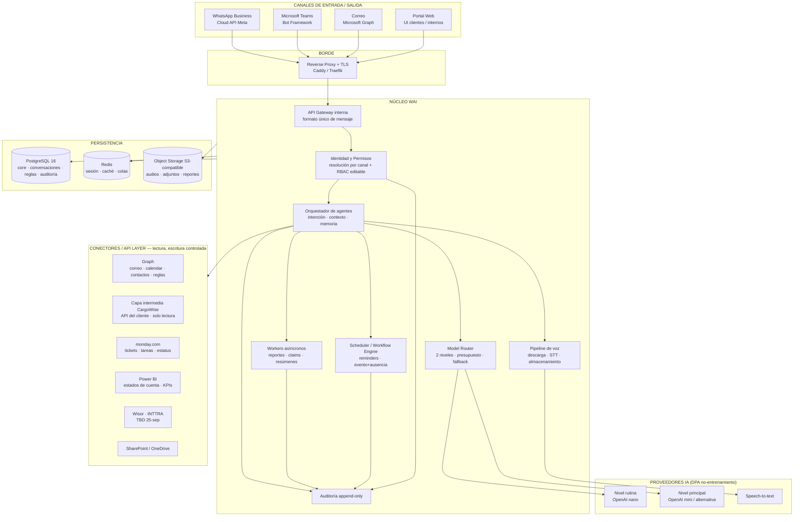

### 2.1 Principios de diseño (derivados del FRD y del contrato)

| # | Principio | Cómo se materializa |
|---|---|---|
| P1 | WAI sugiere y pide aprobación; nunca ejecuta acciones sensibles | Toda acción de escritura pasa por el estado `pendiente_aprobacion` → el usuario confirma por el mismo canal → se ejecuta y se audita. Única escritura libre: monday.com bajo reglas. |
| P2 | Nada avanza sin identidad y permisos | El primer paso del pipeline resuelve `usuario + rol + tenant + canal`. Si no resuelve, WAI responde con el flujo de vinculación, nunca con datos. |
| P3 | CargoWise productiva no se toca | Solo se consume la API de la capa intermedia del cliente. WAI no tiene credenciales de CargoWise. |
| P4 | Aislamiento por cliente y por usuario | El `scope` (tenant, cliente externo, nivel interno, módulos habilitados) viaja en cada request interno y se aplica como filtro en cada conector y cada consulta a PostgreSQL. |
| P5 | Auditoría append-only | Tabla de eventos sin UPDATE/DELETE, con hash encadenado opcional. Registra canal, usuario, instrucción, audio, transcripción, modelo usado, tokens, respuesta, acciones y resultado con zona horaria. |
| P6 | Transparencia de IA | Firma obligatoria "Artificial Intelligence Assistant on behalf of [Usuario]" en correos; aviso de IA en WhatsApp/Teams al iniciar conversación. |
| P7 | Portabilidad total | Un solo `docker-compose` con perfiles `dev` / `prod`. Configuración 100 % por variables de entorno. Adaptadores para storage, secretos y colas. |
| P8 | Presupuesto de IA controlado | Contador de tokens por usuario/rol/mes en Redis+PostgreSQL; alerta al 70 %; degradación al modelo de rutina al 100 % en lugar de corte. |
| P9 | Primero lo que ya tiene datos | Los módulos se ordenan por disponibilidad real de fuente: WhatsApp+Graph primero; CargoWise en cuanto la API del cliente exista. |

### 2.2 Componentes del núcleo

| Componente | Responsabilidad | Notas de diseño |
|---|---|---|
| **API Gateway interna** | Recibe webhooks de canales y peticiones del portal; normaliza a un **mensaje interno único** (`canal, identidad_cruda, tipo, texto/audio/adjunto, metadatos, idempotency_key`) | Idempotencia obligatoria: Meta y Graph reintentan webhooks. |
| **Identidad y Permisos** | Resuelve identidad por canal; carga rol, módulos y segmentos visibles; emite un `scope` firmado para el resto del pipeline | Roles editables desde el módulo de administración (perfil → módulo → segmento/dataset). |
| **Orquestador** | Detecta intención, recupera contexto (Redis sesión, PostgreSQL historial), decide qué conectores y qué nivel de modelo, arma el prompt con el `scope`, genera respuesta | Prompts versionados en repositorio; plantillas para consultas frecuentes (cotización, claim, shipment) para bajar tokens. |
| **Model Router** | Clasifica la tarea; rutina → nano; datos corporativos → principal; escala si el resultado no cumple; fallback entre proveedores; caché de contexto | Política de datos: qué información puede ir a cada nivel. Presupuesto por mes con alerta 70 %. |
| **Pipeline de voz** | Descarga audio del canal, lo guarda en object storage, transcribe, guarda transcripción y la vincula al evento de auditoría | Idioma detectado automáticamente (español/inglés). |
| **Workers** | Tareas largas: generación de reportes PDF/Excel, procesamiento de claims, resúmenes diarios, extracción de datos de cotización | Cola con reintentos y dead-letter. |
| **Scheduler / Workflow Engine** | Reglas de tiempo ("2 días antes del ETA"), monitoreo de hilos (webhooks Graph), reglas evento + ausencia de evento (48 h sin respuesta → escalar) | Husos horarios por usuario. Renovación automática de suscripciones Graph (~3 días). |
| **Auditoría** | Registro append-only de toda interacción y acción | Consultable desde el módulo de administración con filtros por usuario, canal, fecha, módulo. |
| **Módulo de administración** | Gestión de usuarios, roles editables, módulos, segmentos, presupuesto de tokens, catálogo de funcionalidades (códigos únicos), branding del asistente | Es el "módulo de gestión de usuarios" que la reunión del 21-ago calificó como crucial. |

---

## 3. Arquitectura de despliegue: DEV (VPS) → PROD (Azure del cliente)

### 3.1 Estrategia

Un único stack contenerizado que corre idéntico en ambos entornos. El VPS Ubuntu es el entorno de desarrollo e integración continua; el servidor Azure del cliente es producción (y, si el cliente lo entrega antes del 18-sep, también pruebas de aceptación). La migración no es un "re-despliegue": es `git pull` + `docker compose --profile prod up` + restauración de datos.

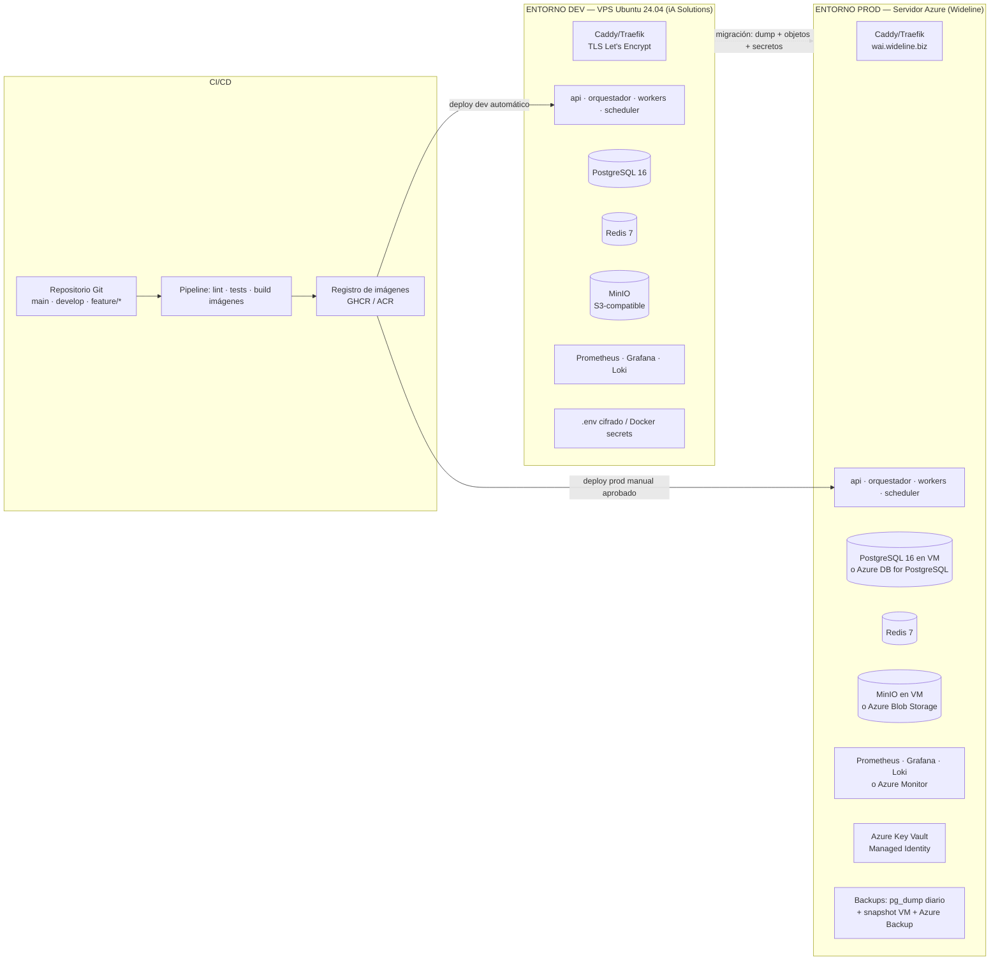

### 3.2 Mapa de componentes por entorno

| Capa | DEV — VPS Ubuntu | PROD — Azure cliente (recomendado) | Cómo se abstrae |
|---|---|---|---|
| Reverse proxy / TLS | Caddy o Traefik (certificado automático) sobre subdominio de pruebas | Mismo contenedor sobre `wai.wideline.biz` | Ninguna diferencia. |
| API / Orquestador / Workers / Scheduler | Contenedores desde imágenes del registro | Mismas imágenes, misma versión etiquetada | Config 100 % por variables de entorno. |
| Base de datos | PostgreSQL 16 en contenedor con volumen | Opción A: PostgreSQL en contenedor sobre la VM (más simple, backups propios). Opción B: Azure Database for PostgreSQL Flexible Server (PITR, HA gestionada) | Cadena de conexión por variable. Migraciones versionadas. |
| Caché / sesión / colas | Redis 7 en contenedor | Redis 7 en contenedor (o Azure Cache for Redis si el cliente lo prefiere) | Ninguna diferencia funcional. |
| Object storage | MinIO (API S3) | MinIO en la VM u Azure Blob Storage | Adaptador `StorageProvider` con implementaciones S3 y Blob. Entrega por URL prefirmada. |
| Secretos | Archivo `.env` cifrado fuera del repo; Docker secrets | Azure Key Vault con Managed Identity de la VM | Adaptador `SecretProvider`. Ninguna credencial en imágenes ni en repositorio. |
| Observabilidad | Prometheus + Grafana + Loki en contenedores | Mismo stack, o Azure Monitor / Log Analytics si IT del cliente lo exige | Logs técnicos 15 días. Auditoría de negocio nunca aquí: vive en PostgreSQL + object storage. |
| Backups | `pg_dump` nocturno a MinIO + copia externa | `pg_dump` diario + snapshot de disco + Azure Backup; prueba de restauración documentada | Runbook de recuperación idéntico. |
| Red / firewall | UFW: 22 (IP restringida), 80, 443 | NSG de Azure: 22 (VPN/IP), 80, 443; resto cerrado | Los webhooks de Meta y Graph requieren 443 público con TLS válido. |
| Dominio | Subdominio de pruebas entregado por Jorge Almaraz | `wai.wideline.biz` (o el que defina IT) | DNS A/AAAA + TXT de verificación de Meta. |

### 3.3 Dimensionamiento

| Entorno | Referencia en documentos | Propuesta |
|---|---|---|
| DEV VPS | Hostinger KVM4 (~USD 178/año) discutido el 21-ago | 4 vCPU · 16 GB RAM · 200 GB NVMe · Ubuntu 24.04 LTS. Suficiente para todo el stack con datos de prueba. |
| PROD Azure | 8 núcleos · 32 GB RAM · 400 GB · alto ancho de banda (reunión 24-ago) para 150–200 usuarios simultáneos | VM tipo D8s v5 o equivalente, disco Premium SSD 400 GB. Si el cliente elige PostgreSQL gestionado, la VM puede bajar a 4–8 vCPU. |

### 3.4 Entornos y ramas

| Rama | Despliega a | Regla |
|---|---|---|
| `feature/*` | Local del desarrollador | Pull request obligatorio hacia `develop`. |
| `develop` | DEV (VPS) automático | Cada merge corre lint + pruebas + build + deploy. |
| `main` | PROD (Azure) manual | Solo desde etiqueta de versión (`v1.0.0`), con aprobación y ventana acordada con el cliente. |

### 3.5 Runbook conceptual de migración DEV → Azure

1. Cliente entrega VM Azure con Ubuntu 24.04, IP pública, NSG con 22/80/443 y usuario de despliegue.
2. Instalar Docker Engine + Compose; crear usuario de servicio sin privilegios; endurecer SSH (llave, sin contraseña, IP restringida).
3. Registrar DNS del subdominio de producción apuntando a la VM; verificar emisión de certificado.
4. Configurar Key Vault (o `.env` cifrado si el cliente no habilita Key Vault) con los secretos de producción: tokens de Meta, app registration de Entra ID, token monday, credenciales de Power BI, API de la capa intermedia, API keys de IA.
5. Desplegar el stack con perfil `prod` en modo vacío; verificar salud de cada contenedor.
6. Migrar datos: `pg_dump` de DEV → `pg_restore` en PROD (solo esquemas core/config: usuarios, roles, catálogo; **no** se migran conversaciones ni auditoría de pruebas); copiar objetos necesarios (plantillas, branding).
7. Reapuntar webhooks: WhatsApp (Meta App), Microsoft Graph (suscripciones), Teams (Azure Bot endpoint), monday (si aplica).
8. Prueba de humo por canal con usuarios demo por nivel; verificar auditoría de extremo a extremo.
9. Activar backups, alertas y presupuesto de tokens; documentar y entregar accesos al cliente.
10. Mantener DEV como entorno de staging para la Póliza de Soporte.

---

## 4. Modelo de datos (alto nivel)

PostgreSQL con esquemas separados por responsabilidad. Se documentan entidades, no DDL.

| Esquema | Entidades principales | Notas |
|---|---|---|
| `core` | `tenant`, `organizacion_cliente` (empresa externa), `usuario`, `identidad_canal` (teléfono WhatsApp, AAD object id, correo, login portal; estado verificado), `rol`, `modulo`, `segmento_datos`, `rol_modulo_segmento` (la matriz editable), `asistente` (nombre, avatar, canal preferido, huso horario, idioma) | Un usuario puede tener varias identidades de canal. La matriz de permisos es una tabla, no código. |
| `conversaciones` | `sesion`, `mensaje` (dirección, canal, tipo, texto, referencia a audio/transcripción), `adjunto`, `accion_pendiente` (borrador, regla, ticket, calendar; estado: propuesta / aprobada / rechazada / ejecutada / expirada) | Memoria de corto plazo en Redis; historial aquí. |
| `reglas` | `regla_prioridad` (remitente, palabras clave, copia, cliente, shipment → urgente/importante/informativo/pendiente), `recordatorio` (fecha/evento, canal, huso), `workflow` (evento A + ausencia de B en N horas → acción), `regla_correo` (propuesta por lenguaje natural, aprobada, creada en Graph), `suscripcion_graph` (recurso, expiración, renovación) | Todo lo que el usuario "le enseña" al asistente. |
| `integraciones` | `credencial_ref` (referencia al secreto, nunca el valor), `estado_conector`, `mapeo_externo` (usuario ↔ id de monday, cliente ↔ código en capa intermedia) | Salud y trazabilidad de cada conector. |
| `ia` | `consumo_tokens` (usuario, rol, modelo, entrada, salida, costo, fecha), `presupuesto` (tenant/rol, límite mensual, umbral de alerta), `prompt_version` | Base del control 70 % / 100 %. |
| `auditoria` | `evento` append-only: timestamp con zona, canal, usuario, scope aplicado, instrucción original, ref. audio, transcripción, intención detectada, conectores consultados, modelo y tokens, respuesta, acciones sugeridas/ejecutadas, resultado, hash del evento anterior | Sin UPDATE/DELETE por permisos de base de datos. Retención permanente. |
| `reportes` | `solicitud_reporte`, `archivo_generado` (ref. object storage, expiración de URL) | PDF/Excel entregados por URL prefirmada. |

**Datos de CargoWise:** no se replican en WAI. Se consumen desde la API de la capa intermedia del cliente en cada consulta, con caché corto en Redis (minutos) y siempre filtrados por el `scope`. Si más adelante el cliente prefiere que WAI aloje una vista materializada, se agrega un esquema `datamart` de solo lectura sin cambiar el resto.

---

## 5. Identidad, roles y control de acceso

### 5.1 Resolución de identidad por canal

| Canal | Identidad cruda | Resolución | Primera vez |
|---|---|---|---|
| WhatsApp | Número de teléfono | Buscar `identidad_canal` verificada | Flujo de vinculación: WAI pide correo corporativo o correo registrado en CargoWise → envía código por correo → el usuario lo responde en WhatsApp → identidad verificada. Para externos, además el área comercial habilita individualmente (26-ago). |
| Teams | AAD object id del tenant Wideline | Usuario interno directo (Teams es solo interno) | Alta automática como Nivel 1 hasta que administración asigne rol. |
| Correo | Dirección del remitente + validación DKIM/SPF | Interno si es `@wideline.biz`; externo si coincide con contacto registrado y habilitado | Si no resuelve, respuesta genérica sin datos y aviso al área comercial. |
| Portal | Login con Entra ID (internos) / invitación con enlace mágico o contraseña (externos) | Sesión con `scope` firmado | Alta gestionada desde el módulo de administración. |

### 5.2 Modelo de roles editables

- **Perfiles base** (semilla): Dirección / Management (N3), Managers especializados (N2), Operativos (N1), Cliente externo, más un **usuario demo por nivel** para pruebas y capacitación.
- **Cada perfil** define, por **módulo** (los 9 del diagrama) y por **segmento de datos** (por ejemplo: shipments propios / de su área / todos; financieros sí/no; tarifas sí/no; profit sí/no), qué puede consultar, solicitar, aprobar o exportar.
- El cliente puede **crear perfiles nuevos y editar los existentes** desde el módulo de administración sin intervención del desarrollador (acuerdo del 26-ago).
- Jorge Almaraz define **qué datos consulta cada perfil**; Daniel Herrera configura los niveles. Esa definición es insumo del cliente y bloquea la sección de CargoWise si no llega.

### 5.3 Aplicación del scope

El `scope` se calcula una vez por request y se propaga a: filtros de la API de la capa intermedia (por cliente/segmento), consultas a Graph (solo el buzón del usuario autenticado, permisos delegados), consultas a Power BI (dataset y filtro por cliente), monday (board y grupo autorizados) y a cada consulta interna en PostgreSQL. Ningún conector puede ejecutarse sin `scope`.

---

## 6. Model Router y control de costos

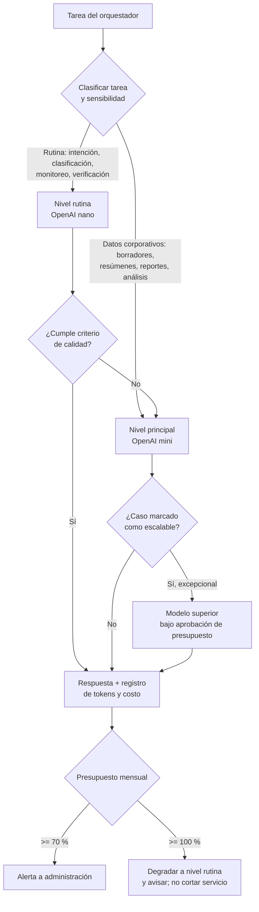

Reglas:
- Proveedor por defecto OpenAI (decisión 21-ago); el router acepta Anthropic u otro proveedor con DPA por configuración, sin cambios de código.
- Plantillas para las consultas más frecuentes (cotización, claim, estatus de shipment) para reducir tokens; tras un mes de piloto se identifican las 3–5 consultas más comunes para automatizarlas (acuerdo 21-ago).
- Caché de contexto y de respuestas a consultas idénticas dentro de una ventana corta.
- Presupuesto configurable por tenant y por rol; el consumo se visualiza en el módulo de administración.

---

## 7. Flujos operativos

### 7.1 Flujo general de interacción (7 pasos del Informe V1)

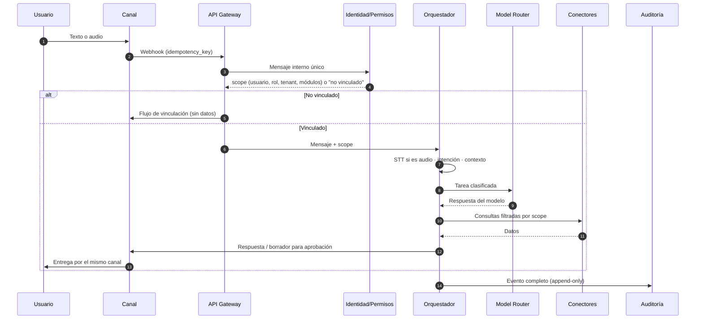

### 7.2 Vinculación de identidad en WhatsApp

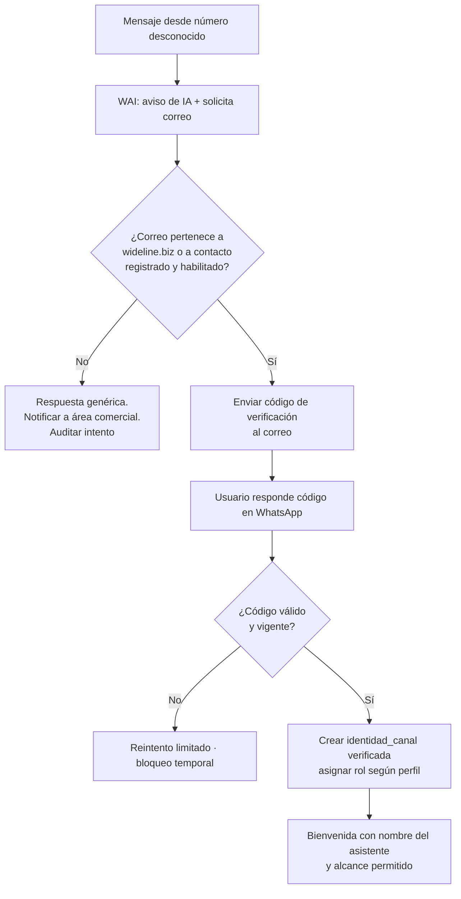

### 7.3 Consulta de shipment por cliente externo (WhatsApp → capa intermedia)

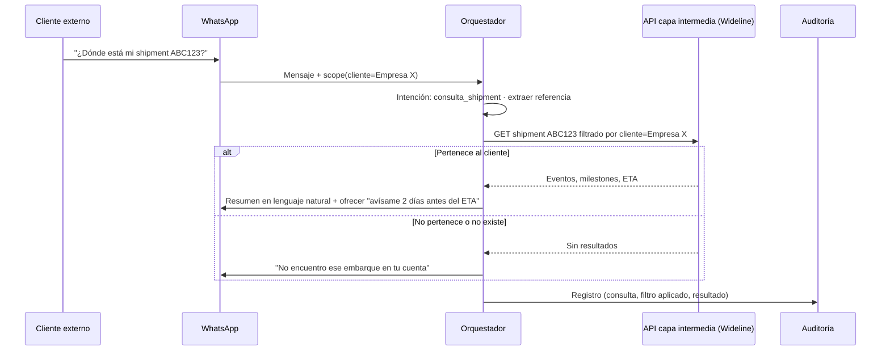

### 7.4 Búsqueda de correo por voz + propuesta de respuesta con aprobación

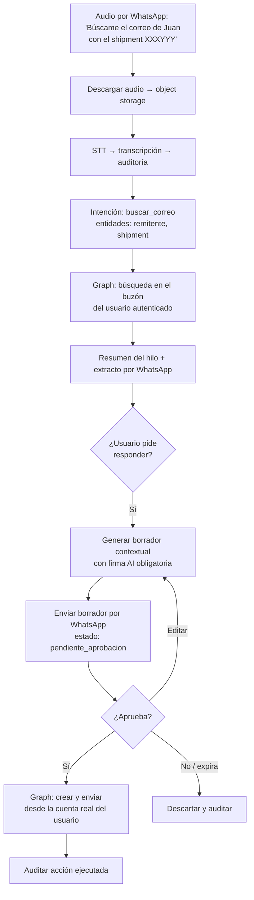

### 7.5 Claim externo → ticket en monday.com

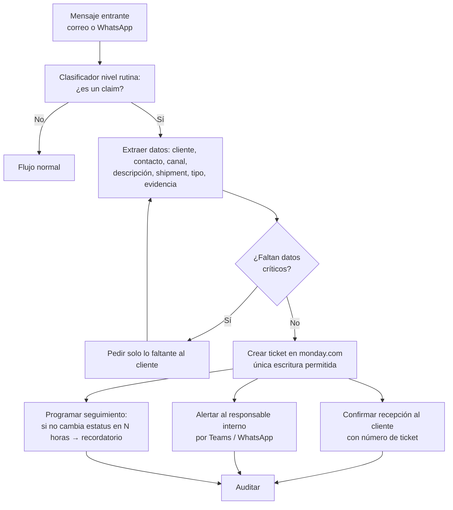

### 7.6 Solicitud de cotización por voz o texto

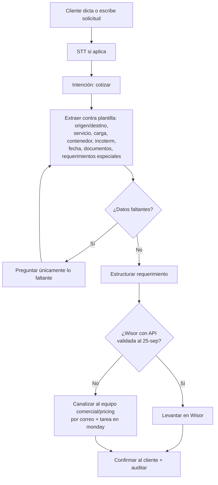

### 7.7 Recordatorios y reglas evento + ausencia de evento

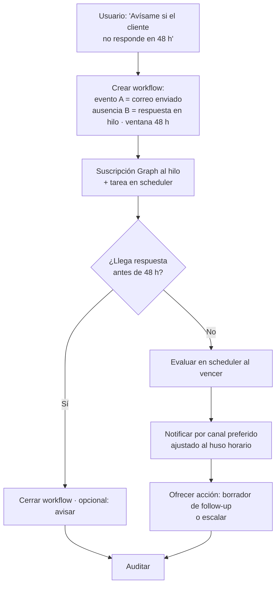

### 7.8 Pipeline de desarrollo y despliegue

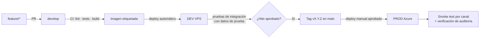

---

## 8. Plan de trabajo re-baselineado (15-sep → 6-nov-2026)

### 8.1 Premisas

- Arranque de desarrollo efectivo: **martes 15 de septiembre**. Las etapas contractuales se conservan; las fechas se recorren y se solapan.
- Plan interno con entrega el **viernes 30 de octubre**; buffer contractual hasta el **6 de noviembre**.
- Esfuerzo total de referencia ~720 h en 7.5 semanas ≈ **95 h/semana de equipo**. Es superior a las 80 h/semana planeadas; requiere confirmar capacidad del equipo o mover a Fase 2 los módulos marcados como "diferibles" en 8.3.
- Cualquier insumo del cliente que llegue tarde se registra en Bitrix/monday y por correo, y prorroga día por día (Cl. 5.4).

### 8.2 Cronograma por semana

| Semana | Fechas | Etapa contractual | Objetivo | Entregable verificable |
|---|---|---|---|---|
| **S1** | 15–18 sep | E0 cierre + E1 | VPS DEV operativo con stack base; repositorio, CI, esqueleto de API con mensaje interno único, esquema de auditoría, módulo de identidad mínimo. Revalidar checklist de accesos con el cliente. | Stack levantado en DEV con `/health` por servicio; primer evento de auditoría registrado; correo de cierre E0/E1 al cliente. |
| **S2** | 21–25 sep | E2 | Orquestador (intención, contexto, memoria), model router de 2 niveles con contador de tokens, pipeline de voz. **WhatsApp**: webhook de recepción y envío (eco con aviso de IA) sobre WABA del cliente o número de pruebas. | **Hito E2:** mensaje WhatsApp → router → modelo → respuesta → auditoría, de punta a punta. Decisión Wisor/INTTRA (25-sep). |
| **S3** | 28 sep–2 oct | E3 + E4 | WhatsApp completo (plantillas aprobadas, notas de voz, vinculación de identidad). Graph: búsqueda de correos y borradores con firma AI. Consumo de la **API de la capa intermedia** CargoWise con filtro por scope. Módulo de administración: roles editables. | Consulta de shipment por WhatsApp filtrada por cliente; búsqueda de correo por voz. Branding recibido (28-sep). |
| **S4** | 5–9 oct | E3 + E4 cierre | Bot de Teams (internos), canal de correo entrante/saliente, monday.com (tickets y estatus), Power BI (estado de cuenta), portal web básico (login, consulta de shipments, reportes). Suscripciones Graph con renovación. | **Hito E4 → pago 25 %:** los 4 canales responden y las 4 integraciones principales leen/escriben correctamente. Correo formal de cierre. |
| **S5** | 12–16 oct | E5 | Módulos: propuestas de respuesta con aprobación, clasificación urgente/importante con reglas por usuario, resúmenes diarios programados, claims externos completos, cotizaciones (extracción + canalización). | Casos de uso del Anexo C del FRD ejecutados en DEV con usuarios demo por nivel. |
| **S6** | 19–23 oct | E5 cierre + migración | Reportes PDF/Excel, recordatorios y workflow engine (evento + ausencia), calendario y reglas de correo por lenguaje natural. **Primer despliegue en Azure** del cliente. Congelamiento de alcance el viernes 23-oct. | Stack en PROD con smoke test por canal; módulos completos. Correo de cierre E5. |
| **S7** | 26–30 oct | E6 | QA: aislamiento multi-tenant (ningún nivel ve fuera de su scope), auditoría de extremo a extremo, presupuesto de tokens, carga básica. Piloto con grupo reducido de internos. | Reporte de QA firmado; KPIs iniciales del piloto (adopción, correos procesados, reminders, no resueltas). |
| **S8 (buffer)** | 2–6 nov | E6 cierre | Ajustes por retroalimentación, documentación operativa, capacitación, entrega de accesos y runbooks. **Go-live 6-nov.** | Acta de aceptación; inicio de Póliza de Soporte. |

### 8.3 Orden de construcción y módulos diferibles

Orden por disponibilidad real de datos (acuerdo 26-ago): **WhatsApp → correo/Graph → capa intermedia CargoWise → Teams → monday → Power BI → portal**.

Módulos candidatos a Fase 2 si la capacidad no alcanza (decisión del cliente, regla de complejidad del FRD): itinerarios INTTRA y cotización directa en Wisor (si no hay API al 25-sep), tarifas contractuales desde Excel, organigrama, analytics avanzado (caída de profit, clientes inactivos) si Power BI no expone los datasets a tiempo, portal para internos (mantener solo portal de clientes).

### 8.4 Hitos y comunicaciones formales

| Fecha | Hito | Comunicación |
|---|---|---|
| 18-sep | Cierre E0/E1 (DEV operativo) · servidor Azure del cliente disponible | Correo de cierre de etapa; inicia plazo de 5 días hábiles. |
| 25-sep | Hito E2 punta a punta · decisión Wisor/INTTRA | Correo con evidencia (video/logs) y acta de decisión. |
| 9-oct | Cierre E4 · hito de pago 25 % | Correo de cierre + CFDI. |
| 23-oct | Cierre E5 · congelamiento de alcance · PROD desplegado | Correo; a partir de aquí solo correcciones. |
| 30-oct | QA y piloto aprobados | Reporte de QA. |
| 6-nov | Go-live · inicio Póliza de Soporte | Acta de aceptación. |

---

## 9. Dependencias del cliente (estado al 15-sep)

Cada ítem pendiente pausa la parte del cronograma que depende de él y se registra como dependencia externa.

| # | Insumo | Responsable (Wideline) | Fecha original | Bloquea | Estado a verificar hoy |
|---|---|---|---|---|---|
| 1 | Meta Business Manager verificado + WABA + número dedicado + token permanente + display name aprobado | IT (cuenta WI) | 4-sep | S2–S3 WhatsApp real (en DEV se puede avanzar con número de pruebas de Meta) | Pendiente confirmar |
| 2 | App registration Entra ID con admin consent (Mail.ReadWrite, Mail.Send, Calendars.ReadWrite, Contacts.Read, MailboxSettings.ReadWrite, User.Read, offline_access) + registro de Azure Bot para Teams | Jorge Almaraz | 4-sep | S3 Graph, S4 Teams | Pendiente confirmar |
| 3 | Cuenta Microsoft 365 "WI" y buzón de pruebas (Yannick Aguilera) | Jorge Almaraz | 26-ago | S3 correo | Pendiente confirmar |
| 4 | Subdominio de pruebas + DNS | Jorge Almaraz | 28-ago | S1 TLS y webhooks | Pendiente confirmar |
| 5 | Servidor Azure con requerimientos de pruebas | Jorge Almaraz | 18-sep | S6 migración | En curso |
| 6 | API de la capa intermedia CargoWise (contrato de endpoints, autenticación, filtros por perfil) + informe de capacidad del webservice | Angel Suárez | "martes de la semana siguiente" al 26-ago | S3 consulta de shipments | Pendiente confirmar |
| 7 | Definición de qué datos consulta cada perfil | Jorge Almaraz | — | S3 roles y scope | Pendiente |
| 8 | Token monday.com + board destino de claims | Cliente | 4-sep | S4 | Pendiente confirmar |
| 9 | Acceso a workspace Power BI + sesión de definición de paneles | Daniel Herrera coordina | 4-sep | S4 | Sesión por agendar |
| 10 | Contactos técnicos y documentación de API de Wisor e INTTRA | Cliente | 4-sep | Decisión 25-sep | Pendiente |
| 11 | Manual de imagen corporativa, logo, colores, nombre/avatar del asistente | Marketing | 28-sep | S3 portal y asistentes | Pendiente |
| 12 | Lista de usuarios por departamento y nivel (Anexo A) + usuarios del piloto | Cliente | 4-sep / 12-oct | S3 roles, S7 piloto | Pendiente |
| 13 | Plantillas de mensajes salientes de WhatsApp validadas por Meta (con insumo de Marketing) | Cliente + equipo | — | S3 notificaciones proactivas | Pendiente |
| 14 | Proyecto en monday con catálogo de funcionalidades (códigos únicos) e invitación a Gustavo | Jorge Almaraz / Angel Suárez | 26-ago | Control de cambios (Cl. Décima) | Pendiente confirmar |

---

## 10. Riesgos y mitigaciones

| Riesgo | Probabilidad | Impacto | Mitigación |
|---|---|---|---|
| Verificación de Meta Business Manager tarda semanas | Alta | Alto: WhatsApp es la primera integración | Desarrollar en DEV con número de pruebas de Meta (Cloud API test number); la WABA real solo cambia tokens y número. Escalar al cliente por correo si no hay avance al 18-sep. |
| API de la capa intermedia CargoWise no lista o incompleta | Media | Alto: bloquea consultas de shipments, claims con referencia, reminders por ETA | Acordar el contrato de la API por escrito en S1; construir contra un mock con el mismo contrato; el cliente asume el retraso (Cl. 12.7 y 5.4). |
| Capacidad de equipo insuficiente para 95 h/semana | Media | Alto | Confirmar equipo esta semana; aplicar la lista de módulos diferibles (8.3) con decisión del cliente antes del 25-sep. |
| Servidor Azure llega tarde o con restricciones de IT | Media | Medio: la migración es en S6, hay margen | DEV es funcional para todas las pruebas de aceptación hasta S6; documentar requisitos mínimos de la VM hoy. |
| Wisor / INTTRA sin API | Alta | Medio | Ya previsto: decisión al 25-sep; canalización por correo + monday como alternativa. |
| Consumo de tokens supera presupuesto | Media | Medio | Router con plantillas, caché y degradación al 100 %; reporte semanal de consumo desde S3. |
| Sobre-alcance vía casos de uso nuevos en monday | Alta | Medio | Aplicar las 3 categorías de la Cláusula Décima en cada funcionalidad; congelamiento el 23-oct. |
| Fecha 26-oct vs 6-nov no aclarada con el cliente | Alta | Medio | Correo esta semana confirmando plan interno al 30-oct y fecha contractual 6-nov. |

---

## 11. Decisiones que necesitamos tomar esta semana

1. **Proveedor y plan del VPS de desarrollo** (Hostinger KVM4 u otro; 4 vCPU/16 GB mínimo) y quién lo paga.
2. **Stack de aplicación:** el Informe V1 asume Python/FastAPI; confirmar lenguaje y framework antes de S1.
3. **PostgreSQL en PROD:** contenedor en la VM (control total, backups propios) o Azure Database for PostgreSQL (gestionado, PITR). Recomendación: contenedor en la VM para Fase 1 si el cliente entrega una sola VM; migrar a gestionado en Fase 2 si crece.
4. **Object storage en PROD:** MinIO en la VM o Azure Blob. Recomendación: Blob si IT del cliente lo habilita; el adaptador permite cualquiera.
5. **Secretos en PROD:** Azure Key Vault (recomendado) o `.env` cifrado gestionado por el cliente.
6. **Modelo principal:** OpenAI mini por defecto (decisión 21-ago) o correr el benchmark corto (15–20 casos) en S2 para dejar evidencia.
7. **Fecha de entrega comunicada:** 30-oct interna / 6-nov contractual.
8. **Módulos diferibles** a presentar al cliente para decisión antes del 25-sep.

---

## Anexo — Correspondencia con el diagrama conceptual aprobado

| Elemento del diagrama | Componente en esta arquitectura |
|---|---|
| Canales de entrada (WhatsApp, Teams, correo, portal, voz) | Sección 2 Canales + pipeline de voz (la voz entra por WhatsApp/Teams como nota de audio, no como canal separado) |
| WAI Orchestration Layer (NLU, intención, decisiones, RAG, LLM, seguridad, auditoría) | Orquestador + Model Router + Identidad/Permisos + Auditoría |
| Servicios transversales (perfil, memoria, workflows, recordatorios, clasificación, notificaciones, plantillas) | Esquemas `core.asistente`, `conversaciones`, `reglas`; Scheduler/Workflow Engine; plantillas de prompts |
| Conectores / API Layer | Sección 2.2 Conectores, con `scope` obligatorio |
| Sistemas fuente (M365, CargoWise, monday, Power BI, SharePoint, INTTRA, Wisor) | Conectores individuales; CargoWise vía capa intermedia del cliente |
| Módulos funcionales (9) | Plan S3–S6 |
| Seguridad y gobernanza | Sección 5 + auditoría append-only + presupuesto de IA |
| Principios clave | Sección 2.1 |
