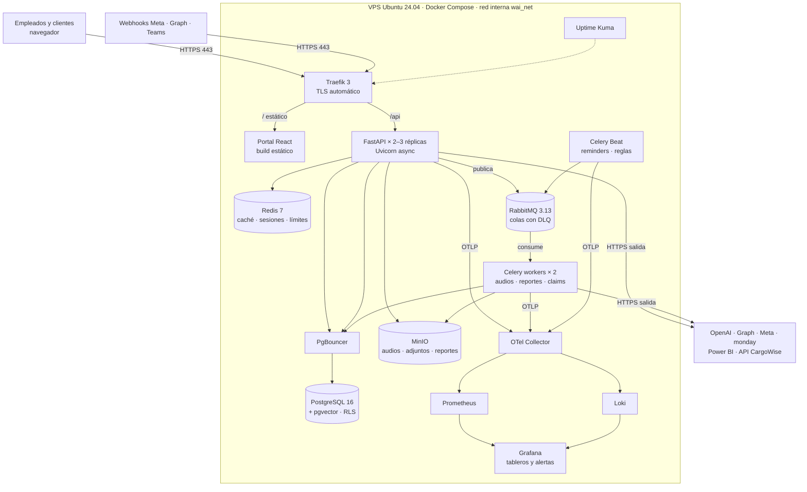
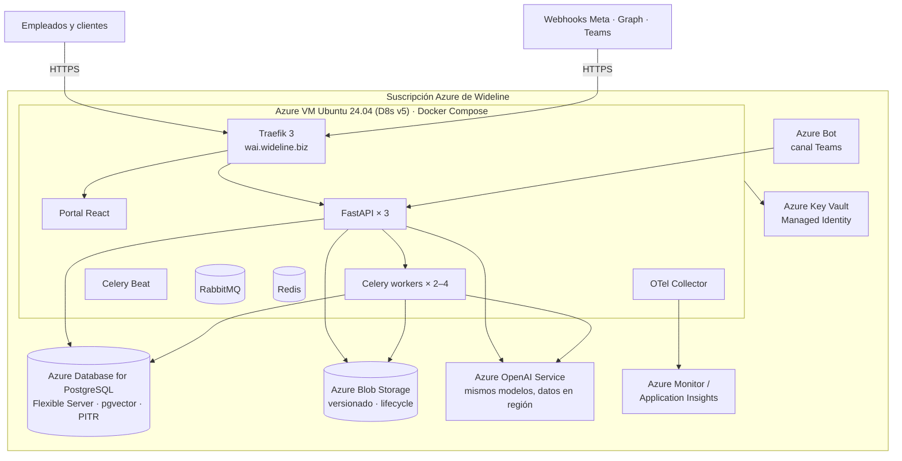

# WAI — Stack Tecnológico Definitivo (Fase 1)

**Versión:** 1.0 · **Fecha:** 15 de septiembre de 2026
**Complementa a:** Arquitectura Técnica y Plan de Trabajo v1 · Metodología de Trabajo v1
**Criterios de selección:** (1) plataforma para ~100 empleados con login propio, dashboard y portal de clientes; (2) escalable a 150–200 usuarios simultáneos en picos; (3) todo lo que corra en el VPS Ubuntu debe moverse a Azure sin reescribir; (4) integración nativa con Microsoft 365, WhatsApp, monday.com, Power BI, Wisor, INTTRA y la API de CargoWise del cliente; (5) equipo pequeño y 7.5 semanas: pocas piezas, maduras y bien documentadas.

---

## 1. Resumen de decisiones

| Capa | Herramienta elegida | Versión | Equivalente en Azure (producción) | Por qué esta y no otra |
|---|---|---|---|---|
| Sistema operativo | Ubuntu Server LTS | 24.04 | Azure VM Ubuntu 24.04 | Misma imagen en ambos lados; soporte hasta 2029. |
| Contenedores | Docker Engine + Docker Compose | 27.x / v2 | Docker en VM → Azure Container Apps al escalar | Compose es suficiente para una VM; las mismas imágenes corren en Container Apps o AKS sin cambios. |
| Proxy inverso / TLS | Traefik | 3.x | Traefik en VM → Azure Application Gateway (opcional) | Certificados Let's Encrypt automáticos y enrutamiento por etiquetas de Docker. Los webhooks de Meta y Graph exigen HTTPS válido desde el día uno. Nginx es alternativa válida si IT del cliente lo prefiere. |
| Backend / API | Python + FastAPI + Uvicorn | 3.12 / 0.115+ | Igual (contenedor) | Async nativo: las llamadas a LLM, Graph y WhatsApp son I/O de alta latencia, no CPU. OpenAPI automática para el frontend. Ecosistema de IA más completo. |
| Validación / ORM / migraciones | Pydantic v2 · SQLAlchemy 2 (async) · Alembic | — | Igual | Estándar de facto con FastAPI; migraciones versionadas y reproducibles en ambos entornos. |
| Colas de tareas | Celery + RabbitMQ (broker) | 5.4 / 3.13 | RabbitMQ en VM → Azure Service Bus (Celery/kombu lo soporta) | RabbitMQ da confirmaciones, reintentos y colas muertas que Redis como broker no garantiza. Necesario para claims, reportes, audios y notificaciones proactivas. |
| Scheduler | Celery Beat | 5.4 | Igual | Dispara reminders y evalúa reglas evento + ausencia. Los horarios viven en PostgreSQL, no en el contenedor. |
| Caché / sesiones / rate limit | Redis | 7.x | Redis en VM → Azure Cache for Redis | Sesiones del portal, caché corto de consultas a CargoWise/Graph, contadores de tokens y límites por usuario. |
| Base de datos | PostgreSQL + pgvector | 16 | PostgreSQL en VM → **Azure Database for PostgreSQL Flexible Server** (soporta pgvector y PgBouncer integrado) | Un solo motor para datos, reglas, auditoría y búsqueda semántica. Row-Level Security para aislar clientes. |
| Pooling de conexiones | PgBouncer | 1.23 | PgBouncer integrado de Flexible Server | Con 3 réplicas de API y workers, sin pooler se agotan conexiones. |
| Object storage | MinIO (API S3) | RELEASE.2025 | **Azure Blob Storage** vía adaptador | Audios, transcripciones, adjuntos, PDFs y Excel. MinIO habla S3 y Blob no; por eso el código usa una interfaz `StorageProvider` con dos implementaciones. |
| Frontend | React + TypeScript + Vite | 18 / 5.x / 6.x | Igual (estático servido por Traefik o Azure Static Web Apps) | Ver justificación en 3.1. |
| UI y datos del frontend | Tailwind CSS · shadcn/ui · TanStack Query y Table · Recharts · MSAL.js | — | Igual | Dashboard con tablas grandes, gráficos y filtros; MSAL.js para login corporativo con Entra ID. |
| Autenticación internos | Microsoft Entra ID (OIDC / SSO) + MSAL | — | Igual (es el Entra ID del cliente) | Los 100 empleados entran con su cuenta corporativa; el mismo consentimiento habilita Graph. Sin contraseñas nuevas ni doble alta. |
| Autenticación externos | Enlace mágico por correo + JWT propio (opción: Entra External ID en Fase 2) | — | Igual | Clientes externos no tienen cuenta en el tenant; se validan contra contactos registrados en CargoWise y habilitación del área comercial. |
| Autorización | RBAC propio en PostgreSQL (rol → módulo → segmento) | — | Igual | Los roles deben ser editables por el cliente; ninguna librería fija lo permite igual de simple. |
| Modelos de IA | OpenAI API en DEV → **Azure OpenAI Service** en PROD | gpt-5.4-nano / gpt-5.4-mini (o los vigentes) | Azure OpenAI | Mismos modelos y misma API; en producción los datos quedan en la región de Azure del cliente y se facturan en su suscripción (Cláusula Octava). Cambiar de OpenAI a Azure OpenAI es cambiar dos variables de entorno. |
| Router de modelos | LiteLLM (librería) | 1.5x+ | Igual | Abstracción de proveedor (OpenAI, Azure OpenAI, Anthropic), fallback, presupuestos por clave/usuario, alertas de gasto y costo por llamada. Cubre el requisito del 70 %. |
| Embeddings / RAG | text-embedding-3-small + pgvector | — | Azure OpenAI embeddings | Base de conocimiento: FAQ, manual de imagen, plantillas, políticas. Sin motor vectorial adicional. |
| Speech-to-text | gpt-4o-mini-transcribe (OpenAI) | — | Azure OpenAI Whisper / Azure AI Speech | Notas de voz de WhatsApp y Teams en español e inglés. |
| WhatsApp | Meta WhatsApp Cloud API (directo, sin BSP) | v21+ | Igual | Sin intermediario ni margen de BSP; webhooks a Traefik/FastAPI. Requiere Business Manager verificado (trámite del cliente). |
| Teams | Bot Framework SDK para Python + Azure Bot | 4.x | Igual (Azure Bot ya es Azure) | Único camino soportado para bots en Teams; el registro del bot lo hace IT del cliente. |
| Microsoft Graph | Microsoft Graph SDK (Python) + MSAL (Python) + change notifications | 1.x | Igual | Correo, calendario, contactos, reglas y suscripciones a cambios con renovación automática. |
| monday.com | API GraphQL (httpx) | 2024-10 | Igual | Única escritura permitida: tickets, tareas, estatus. |
| Power BI | Power BI REST API + DAX queries (httpx) | v1 | Igual | Lectura de estados de cuenta, deuda y KPIs desde datasets autorizados. |
| CargoWise | API de la capa intermedia del cliente (httpx) | por definir con Angel Suárez | Igual | Solo lectura; contrato de API acordado en S1 y mock local. |
| Wisor / INTTRA | Adaptadores httpx si hay API; si no, canalización por correo + monday | TBD 25-sep | Igual | Decisión contractual pendiente. |
| Reportes PDF / Excel | WeasyPrint (HTML → PDF) · openpyxl · Plotly (gráficos estáticos) | — | Igual | Plantillas HTML con branding Wideline; Excel nativo con tablas y gráficos. |
| Observabilidad | OpenTelemetry SDK → OTel Collector · Prometheus · Loki · Grafana | — | Mismo stack en VM, o **Azure Monitor / Application Insights** cambiando el exportador | Instrumentar con OpenTelemetry desde el día uno permite que el destino sea Grafana o Azure Monitor sin tocar código. Logs técnicos 15 días; la auditoría de negocio va a PostgreSQL. |
| Errores | GlitchTip (compatible con Sentry) | — | Application Insights | Trazas de excepciones con contexto. Opcional en Fase 1. |
| Disponibilidad | Uptime Kuma | — | Azure Monitor availability tests | Alertas de caída de webhooks y portal. |
| Secretos | SOPS + age (archivos cifrados en el repo) en DEV | — | **Azure Key Vault** con Managed Identity en PROD | Interfaz `SecretProvider`; ninguna credencial en imágenes ni en texto plano. |
| CI/CD | GitHub Actions → GitHub Container Registry → despliegue por SSH | — | Igual, o Azure Container Registry + GitHub Actions | `develop` despliega a DEV automáticamente; `main` con etiqueta despliega a PROD con aprobación. |
| Backups | pg_dump diario + restic hacia MinIO y copia externa | — | PITR de Flexible Server + Azure Backup de la VM + Blob con versionado | Prueba de restauración documentada en S1 y repetida en S6. |
| Pruebas | pytest · pytest-asyncio · Playwright · Locust | — | Igual | Locust valida 200 usuarios simultáneos antes del go-live. |
| Calidad de código | Ruff · mypy · ESLint · Prettier · pre-commit | — | Igual | Revisión automática en cada PR. |
| Endurecimiento del host | UFW · fail2ban · unattended-upgrades · SSH solo con llave | — | NSG de Azure + Azure Update Manager + Bastion opcional | Solo 22 (IP restringida), 80 y 443 abiertos. |

---

## 2. Topología

### 2.1 Entorno DEV — VPS Ubuntu (un host, Docker Compose)



### 2.2 Entorno PROD — Azure del cliente (arranque en una VM, ruta de crecimiento)



**Fase 1 mínima en Azure:** una VM con el mismo `docker-compose` del VPS (PostgreSQL, Redis, RabbitMQ y MinIO como contenedores) más Key Vault y Azure OpenAI. Es lo que exige la Cláusula Octava y lo que Jorge Almaraz comprometió para el 18-sep.
**Fase 1 recomendada:** VM + PostgreSQL Flexible Server + Blob Storage. Saca de la VM lo único irrecuperable (datos y auditoría) y lo pone en servicios con respaldo gestionado. Costo adicional moderado; sin cambio de código, solo variables de entorno.

---

## 3. Justificación de las decisiones con más de una opción razonable

### 3.1 Frontend: React + Vite en lugar de Angular

Ambos resuelven un portal con login, dashboard y tablas. Se elige React por cuatro razones concretas para este proyecto:

1. **Superficie pequeña.** Fase 1 tiene tres pantallas grandes (dashboard, consultas/reportes, administración de roles) y un portal de clientes. Angular está optimizado para aplicaciones enormes con muchos equipos; aquí su estructura (módulos, inyección, RxJS) añade tiempo sin retorno.
2. **Velocidad en 7.5 semanas.** Vite compila en milisegundos y shadcn/ui entrega componentes accesibles listos para un dashboard corporativo. El branding de Wideline se aplica con tokens de Tailwind.
3. **Integración con Entra ID.** MSAL.js tiene soporte de primera clase para React (`@azure/msal-react`); en Angular funciona pero con más configuración manual.
4. **Disponibilidad de talento y de asistencia por IA.** Hay más desarrolladores y más ejemplos de calidad; el costo de que alguien nuevo entre al proyecto es menor.

Si el equipo ya domina Angular y no React, Angular 18+ con signals es aceptable: el backend expone OpenAPI y no cambia nada. El costo de la decisión es bajo; el costo de aprender un framework durante el proyecto es alto.

### 3.2 RabbitMQ como broker y Redis para caché

Redis puede hacer de broker, pero pierde mensajes si el proceso muere antes de confirmar y no tiene colas muertas nativas. En WAI una tarea perdida es un claim sin ticket o un reminder que nunca salió. RabbitMQ confirma cada mensaje, reintenta y aparta los fallidos. Redis se queda con lo que hace mejor: caché de milisegundos, sesiones y contadores. Un contenedor más a cambio de no perder trabajo.

### 3.3 Traefik frente a Nginx

Traefik detecta contenedores por etiquetas, renueva certificados solo y expone métricas a Prometheus. Nginx exige archivos de configuración y Certbot. Para un equipo pequeño que despliega varias veces al día, la operación manual de Nginx es fricción sin beneficio. Si IT de Wideline exige Nginx en producción, el cambio es de un contenedor y no toca la aplicación.

### 3.4 Azure OpenAI en producción

Los modelos son los mismos de OpenAI, pero los datos se procesan dentro de la suscripción Azure del cliente (residencia regional, red privada opcional), la facturación cae en su cuenta como exige el contrato y el DPA se cubre con los términos empresariales de Microsoft. LiteLLM permite que DEV use OpenAI directo y PROD use Azure OpenAI con la misma llamada.

### 3.5 PostgreSQL con pgvector en lugar de un motor vectorial aparte

La base de conocimiento de Fase 1 es pequeña (FAQ, plantillas, políticas, manual de imagen). pgvector la resuelve dentro del mismo motor con las mismas reglas de RLS. Un motor vectorial separado (Qdrant, Weaviate) sería otro contenedor, otro backup y otra migración sin ganancia medible a esta escala.

### 3.6 Celery en lugar de alternativas más nuevas

Hay opciones más ligeras (ARQ, Dramatiq, Taskiq). Celery se elige por Beat integrado, soporte de RabbitMQ y de Azure Service Bus, reintentos con backoff y quince años de documentación de fallas conocidas. En un proyecto con esta presión de tiempo, la madurez pesa más que la elegancia.

---

## 4. Escalabilidad: 100 empleados, 150–200 sesiones simultáneas

### 4.1 Dónde está la carga real

El cuello de botella de WAI no es CPU ni base de datos: es la **latencia de terceros** (LLM 2–8 s, Graph 0.3–1 s, WhatsApp 0.5 s). Por eso el diseño es async y desacoplado por colas: la API responde al webhook en milisegundos, encola el trabajo y el worker responde al usuario cuando el modelo termina. Con eso, 200 conversaciones simultáneas son 200 tareas en cola, no 200 hilos bloqueados.

### 4.2 Dimensionamiento por etapa

| Etapa | Cuándo | Configuración | Capacidad estimada |
|---|---|---|---|
| **A — Una VM (Fase 1)** | Go-live 6-nov | VM 8 vCPU / 32 GB. API × 3 réplicas (2 workers Uvicorn cada una), Celery workers × 2 (concurrencia 8), PostgreSQL y Redis en contenedor, PgBouncer con pool 50. | 100 empleados + clientes piloto; 200 sesiones simultáneas con respuestas dependientes del LLM. Validado con Locust en S7. |
| **B — Datos gestionados** | Al pasar de 20 a 125 clientes externos (plan de onboarding gradual) | PostgreSQL Flexible Server (B2ms → D2ds), Blob Storage, Azure Cache for Redis. La VM solo corre servicios sin estado. | Elimina el riesgo de disco lleno y de pérdida de datos; permite escalar la VM o clonarla. |
| **C — Servicios sin estado en Container Apps** | Si el consumo crece más allá de una VM (Fase 2) | API y workers en Azure Container Apps con autoescalado por cola y por CPU; RabbitMQ → Azure Service Bus; Traefik → ingress de Container Apps. | Escala horizontal automática. Mismas imágenes Docker; solo cambia el orquestador. |

### 4.3 Reglas para que escale sin reescribir

- **Servicios sin estado:** API, workers y beat no guardan nada en disco local. Sesiones en Redis, archivos en object storage, colas en RabbitMQ. Cualquier réplica puede atender cualquier petición.
- **Idempotencia en webhooks:** Meta y Graph reintentan. Cada mensaje trae una clave única guardada en Redis; los duplicados se descartan.
- **Colas por prioridad:** `interactivo` (respuestas a usuarios), `proactivo` (reminders y alertas), `batch` (reportes, resúmenes diarios). Un reporte pesado nunca retrasa una respuesta de WhatsApp.
- **Caché con TTL corto** sobre CargoWise (2–5 min) y Graph (30–60 s) para absorber ráfagas sin castigar las APIs del cliente.
- **Límites por usuario y rol** en Redis: peticiones por minuto y tokens por mes; degradación al modelo de rutina al 100 % del presupuesto en lugar de corte.
- **Migraciones compatibles hacia atrás** (Alembic): agregar columnas antes de usarlas, nunca eliminar en el mismo despliegue. Permite despliegue sin caída con varias réplicas.
- **Salud y métricas por servicio:** `/health` y `/metrics` en cada contenedor; Traefik saca de rotación la réplica que falla.

---

## 5. Servicios del `docker-compose` (un archivo, dos perfiles)

| Servicio | Imagen base | Perfil | Volumen | Puertos expuestos | Notas |
|---|---|---|---|---|---|
| `traefik` | traefik:3 | dev, prod | certificados | 80, 443 | Único servicio con puertos públicos. |
| `api` | imagen propia (python:3.12-slim) | dev, prod | — | interno 8000 | Réplicas configurables; `--scale api=3`. |
| `worker` | misma imagen que `api` | dev, prod | — | — | Comando Celery worker; colas `interactivo`, `proactivo`, `batch`. |
| `beat` | misma imagen que `api` | dev, prod | — | — | Una sola instancia. |
| `portal` | imagen propia (build de Vite → nginx:alpine o servido por Traefik) | dev, prod | — | interno 80 | Estático; variables de entorno inyectadas en build. |
| `postgres` | pgvector/pgvector:pg16 | dev, prod-vm | `pg_data` | interno 5432 | En PROD recomendado sustituir por Flexible Server. |
| `pgbouncer` | edoburu/pgbouncer | dev, prod-vm | — | interno 6432 | Innecesario si Flexible Server con pooler integrado. |
| `redis` | redis:7-alpine | dev, prod | `redis_data` | interno 6379 | Persistencia AOF activada. |
| `rabbitmq` | rabbitmq:3.13-management | dev, prod | `mq_data` | interno 5672, consola 15672 (solo vía Traefik con auth) | Colas durables y DLQ. |
| `minio` | minio/minio | dev, prod-vm | `minio_data` | interno 9000, consola 9001 | En PROD recomendado sustituir por Blob Storage. |
| `otel-collector` | otel/opentelemetry-collector-contrib | dev, prod | — | interno 4317/4318 | Exporta a Prometheus/Loki o a Azure Monitor. |
| `prometheus` | prom/prometheus | dev, prod-vm | `prom_data` | — | Retención 15 días. |
| `loki` | grafana/loki | dev, prod-vm | `loki_data` | — | Retención 15 días. |
| `grafana` | grafana/grafana | dev, prod-vm | `grafana_data` | vía Traefik con auth | Tableros: colas, latencia LLM, tokens, errores, webhooks. |
| `uptime-kuma` | louislam/uptime-kuma | dev, prod | `kuma_data` | vía Traefik con auth | Alertas por correo/Teams. |
| `glitchtip` | glitchtip/glitchtip | opcional | — | vía Traefik | Errores con contexto; sustituible por Application Insights. |
| `backup` | imagen propia (postgres-client + restic) | dev, prod-vm | — | — | Cron diario; sube a MinIO/Blob y a destino externo. |

Red: una red bridge interna `wai_net`; solo `traefik` publica puertos al host. Todas las imágenes se construyen para `linux/amd64` (arquitectura de las VMs Azure de propósito general).

---

## 6. Estructura del repositorio (monorepo)

```
wai/
├── apps/
│   ├── api/            FastAPI: routers por canal y módulo, orquestador, router de modelos, conectores
│   ├── worker/         tareas Celery (comparte código con api vía paquete común)
│   └── portal/         React + Vite: dashboard, administración, portal de clientes
├── packages/
│   ├── core/           dominio, permisos (scope), auditoría, adaptadores (storage, secretos, colas)
│   ├── connectors/     graph, whatsapp, teams, monday, powerbi, cargowise, wisor, inttra
│   └── prompts/        prompts versionados y plantillas de consultas frecuentes
├── infra/
│   ├── compose/        docker-compose.yml, perfiles dev/prod, .env.example
│   ├── traefik/        configuración dinámica y middlewares
│   ├── otel/           colector, tableros Grafana, reglas de alerta
│   └── azure/          notas y scripts de preparación de la VM, Key Vault, Flexible Server
├── db/
│   └── migrations/     Alembic
├── docs/
│   ├── adr/            decisiones de arquitectura
│   ├── runbooks/       despliegue, migración, recuperación, renovación de tokens
│   └── api-contracts/  contrato de la capa intermedia CargoWise y de cada conector
└── .github/workflows/  CI (lint, tests, build) y CD (dev automático, prod manual)
```

---

## 7. Lista de verificación de compatibilidad con Azure

Cada punto se revisa en el PR; si alguno falla, la migración deja de ser "cambiar variables".

- [ ] Imágenes `linux/amd64`, sin dependencias del host ni rutas absolutas.
- [ ] Toda configuración por variables de entorno; sin archivos de configuración incrustados en la imagen.
- [ ] Secretos solo a través de `SecretProvider` (SOPS en DEV, Key Vault en PROD).
- [ ] Archivos solo a través de `StorageProvider` (MinIO/S3 en DEV, Blob en PROD); entrega por URL prefirmada en ambos.
- [ ] Cadena de conexión a PostgreSQL parametrizada, con TLS obligatorio (Flexible Server lo exige).
- [ ] Broker parametrizado (RabbitMQ AMQP o Azure Service Bus) sin lógica específica en las tareas.
- [ ] Proveedor de IA parametrizado en LiteLLM (OpenAI o Azure OpenAI) con los mismos nombres lógicos de modelo.
- [ ] Telemetría por OpenTelemetry; el exportador se decide por configuración.
- [ ] `/health` y `/metrics` en todos los servicios.
- [ ] Sin `localStorage` ni estado en disco en la API o los workers.
- [ ] Migraciones Alembic reproducibles desde cero y prueba de restauración de backup documentada.
- [ ] Webhooks con URL configurable (cambia el dominio, no el código).

---

## 8. Requisitos de la VM de Azure que debemos pedir a Jorge Almaraz

| Requisito | Valor |
|---|---|
| Imagen | Ubuntu Server 24.04 LTS |
| Tamaño (Fase 1, etapa A) | Standard_D8s_v5 (8 vCPU, 32 GB) o D4s_v5 si PostgreSQL va a Flexible Server |
| Disco | Premium SSD 400 GB (datos) + 64 GB (SO) |
| Red | IP pública estática; NSG con 22 (IP de iA Solutions), 80 y 443 |
| DNS | Registro A de `wai.wideline.biz` (o el subdominio que IT defina) hacia la IP pública |
| Identidad | Managed Identity asignada a la VM con acceso a Key Vault |
| Servicios adicionales recomendados | Azure Database for PostgreSQL Flexible Server (con pgvector habilitado), Storage Account con Blob, Key Vault, Azure OpenAI (solicitar acceso; puede tardar días), Azure Bot para Teams |
| Acceso | Usuario de despliegue sin privilegios con llave SSH; sudo limitado a Docker |
| Respaldos | Azure Backup de la VM (diario, 30 días) y PITR en Flexible Server (7–35 días) |

---

## 9. Decisiones registradas como ADR

| ADR | Decisión | Estado |
|---|---|---|
| 001 | Stack contenerizado con Docker Compose; migración por imágenes | Aprobada en este documento |
| 002 | FastAPI + Celery + RabbitMQ + Redis | Aprobada |
| 003 | PostgreSQL 16 + pgvector + RLS como único almacén de datos | Aprobada |
| 004 | React + Vite + MSAL para el frontend | Aprobada; Angular como alternativa si el equipo lo exige |
| 005 | Traefik como proxy; Nginx aceptado si IT del cliente lo pide en PROD | Aprobada |
| 006 | OpenAI en DEV, Azure OpenAI en PROD, LiteLLM como router | Aprobada |
| 007 | MinIO en DEV, Azure Blob en PROD vía adaptador | Aprobada |
| 008 | OpenTelemetry con Grafana en DEV y Grafana o Azure Monitor en PROD | Aprobada |
| 009 | Entra ID para internos; enlace mágico para externos | Aprobada |
| 010 | PostgreSQL gestionado en Azure (Flexible Server) frente a contenedor en VM | Recomendado Flexible Server; requiere aprobación de costo del cliente |
